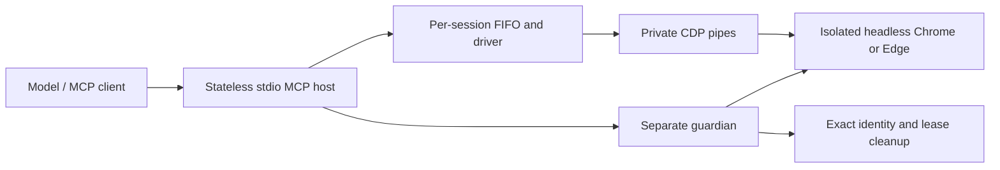

# Newton Browser: adversarial architecture and agent-loop audit

Date: 2026-09-07. Audited production source: `f2ae1ee71c66bea3488926df8332bec2d1ec7cfc`, version 0.6.4. This audit changes documentation and adds diagnostic regression harnesses; it does not repair or deploy the runtime.

Follow-up: the [session engine design](SESSION_ENGINE_DESIGN.md) develops the replacement
architecture requested after this audit. Its vertical implementation slices supersede
the issue-by-issue repair sequence below; the findings and evidence remain applicable.

## Verdict

The owned-browser foundation is worth keeping. The agent-facing execution contract needs substantial correction before Newton can be called reliable for long, consequential application workflows. Its main problem is not TypeScript or process startup. It spends work collecting state that the model never receives, couples successful input to unrelated observation failures, and sometimes reports a stronger outcome than the browser evidence supports.

The existing 490-test suite passes. The new adversarial harness nevertheless reproduces 13 problematic behaviors on both installed Chrome and Edge. These include correctness defects, a sensitive-field check race, and architectural limitations; the timeout experiment specifically demonstrates a limitation rather than proving that retaining a running command is itself wrong. Small output and green release receipts currently overstate useful agent capability.

There is no defensible measured parity claim with ChatGPT's Chrome control. This audit has neither its private implementation nor a matched task benchmark. The target should be observable behavior: fewer model turns, useful immediate state, accurate effect outcomes, precise targeting, bounded recovery, and low operator intervention. Copy those properties, not an imagined proprietary architecture.

## Evidence and scope

Read-only task review included:

- [Newton Browser Development](codex://threads/019fe3c8-bfa1-7801-b980-3dd00a120566): recent development, the removal of network containment, 0.6.1–0.6.4 incident/release narratives, and the later remote-viewer proposal.
- [Independent Newton Browser Implemen…](codex://threads/019fef22-3a08-7802-ba30-6b8973b0564f): the specifically requested earlier audit.
- [Newton AIP-01 command pump primitive](codex://threads/019fe444-277a-7322-b1a4-3ef54d170ff7), [Newton AIP-02 transaction primitive](codex://threads/019fe444-278b-73c0-9d42-a32ad8a640d3), [Newton AIP-02 bounded MCP framing](codex://threads/019fe444-32c8-74b0-9ff8-19c6448c2d9e), and [Newton AIP-09 eval foundation](codex://threads/019fe444-32f3-7783-92a7-8d643ade56f6): worker implementation and correction summaries.

No task was messaged and no subagent was used. Bubble's current version-8 memory guided the review: inspect callers and real outcomes, prefer subtraction, and distinguish source, tests, packages, deployment, and useful work. Historical task instructions were treated as evidence, not fresh authorization.

The code review traced MCP admission and cancellation, session provisioning, browser/guardian ownership, identity recovery/import, CDP routing, target and frame tracking, input, observation, projection/redaction, release scripts, and evaluations. It is not a proof of every browser interleaving, OS failure mode, or third-party application's behavior.

Fresh verification is summarized below and recorded in the [verification manifest](../test/evidence/audit-verification-2026-09-07.json):

| Check | Result and meaning |
| --- | --- |
| `pnpm build` | Pass; builds the audited source locally |
| `pnpm typecheck` | Pass |
| `pnpm lint` | Pass; this is the architecture boundary scanner, not general lint |
| `pnpm test` | 490 passed, zero failed/skipped |
| `pnpm eval:agent-cost` | Pass; catalog 2,881 tokens, fixed projected workflow 658 tokens |
| `pnpm audit:current` | Intentionally fails the corrected-contract gate: 13 behaviors reproduced in Chrome and Edge |
| `pnpm audit:guardian` | Synthetic Windows root-exit case passed; did not reproduce a surviving descendant |

The audit browser runs use Node 25.9.0, Windows, private CDP, new isolated identities, and a local HTTP fixture. Browser versions and bounded results are in [Chrome evidence](../test/evidence/audit-current-runtime-2026-09-07-chrome.json) and [Edge evidence](../test/evidence/audit-current-runtime-2026-09-07-edge.json). No credentials, authenticated websites, existing sessions, or ordinary profiles were used. Both runs confirmed cleanup. [Guardian evidence](../test/evidence/audit-guardian-exit-2026-09-07.json) is a negative result, not evidence of a lifecycle defect.

`pnpm audit:current` rebuilds the driver and executes [the diagnostic regression harness](../scripts/audit-current-runtime.mjs). Its nonzero status means a recorded corrected-contract expectation is unmet. It is separate from the existing suite so the audit does not quietly redefine a failing behavior as a passing production regression. After repairs, replace diagnostic observations with focused production regression assertions and retire redundant harness cases.

No new release, packed-browser matrix, Linux run, authenticated workflow, or statistical performance benchmark was performed. The pre-existing untracked `release-verification-win32.json` was preserved. It records three passes for the original commit; it does not certify this edited tree or negate the new findings.

## What is actually built today

The physical path is compact:

The implementation path is longer: `mcp-server` validates and shapes a tool; `configured-direct-host` discovers a browser and selects/leases an identity; `direct-browser-host` owns sessions, idempotency and floor decisions; `direct-session-runtime` owns the command pump; `driver` resolves evidence, executes input and observes; `direct-debugger-port` translates root/browser/child routes; `cdp-pipe` owns wire correlation and bounds. Results return through the host, redaction, and agent projection.

These layers have real responsibilities. They become bloat where the same fact is repeatedly normalized or lost between them. The current driver is 3,935 lines, the target registry 1,193, the MCP server 945, and the profile store 915. Those counts locate review pressure; they do not prove that every line is unnecessary.

Current behavior that must remain explicit:

- One isolated browser process and exclusive identity lease per session; separate sessions have separate queues and processes.
- MCP sessions are headless. Operator login is a separate visible workflow. There is no live remote handoff/viewer in this repository.
- Startup accepts an exact normalized origin and navigates to its root. A deep URL requires a later navigate action, despite broader wording in some docs.
- Chromium networking is ordinary and unfiltered. Origin is not a network grant.
- Same-session primitive actions are FIFO. `fill_form` is expanded outside the queue, so the whole batch is not one atomic queue entry.
- Interactive observations replace the active ref set, including observations performed privately during actions and targeting. Text observations allocate no refs.
- `browser.act` returns outcome, decision, change categories and sequence. It does not return the observation it just computed.
- The typed input promise is not uniformly implemented: native `select` directly sets DOM value and dispatches synthetic events.
- The guardian is Node code using Windows `taskkill /T /F` or Unix process-group termination. There is no Newton-authored Windows Job Object implementation in current source.

## Historical findings: resolved, superseded, or still relevant

The requested old audit must not be copied into a current defect list unchanged.

| Earlier finding | Current disposition |
| --- | --- |
| No out-of-process crash cleanup | Superseded: a guardian now exists; preserve and audit it |
| Proxy attribution and HTTPS CDN denial | Removed with the proxy/origin-grant architecture; do not restore it |
| Extension removal incomplete | Obsolete: extension, relay and transition paths are deleted |
| Screenshot masking is a no-op | Obsolete: trusted PNG raster masking exists; moving-target capture races remain documented |
| 128 idempotency keys with no expiry | Fixed in source: 256 entries and ten-minute TTL |
| Direct tests omitted from release command | Fixed: current complete release command runs source live and packed direct checks |
| Source maps in package | Build/pack hardening exists; no new packed artifact was audited here |
| Synthetic evidence overstates maturity | Still relevant: production-site read checks do not establish authenticated task completion |
| Generic errors obscure recovery | Still relevant beyond the repaired identity-busy cases |

The recent history is more instructive than an old requirement checklist: a 0.6.1 POST-after-click classification falsely claimed prevention; 0.6.2 repaired exhausted refs; 0.6.3 repaired popup control; 0.6.4 repaired stale identity recovery. Those are useful fixes. They also show that the earlier release matrix repeatedly missed the workflows the operator actually needed. The new partial-batch result reproduces the same family of false-prevention mistake at a different composition boundary.

## Findings requiring correction

### A01 — High: the sensitive-field decision is detached from the eventual input target

`direct-session-runtime.ts:99` resolves evidence and calls the floor guard before invoking the driver action. `driver.ts:2024` subsequently resolves/focuses the field, sometimes resolves it again, and dispatches input without rerunning that guard against the final facts. Focus is a real page event and can change the element or its type.

Repro: the fixture has a normal text input whose focus handler changes its type to password. Fill it with a harmless synthetic marker. Chrome and Edge both return `verified`; the password input received the marker. See `floor_target_changes_after_check` in both receipts. No secret was supplied or read.

Root cause: the decision authorizes earlier evidence, not a target-and-document binding checked at the last pre-input boundary. A selector refresh can also select a replacement element after the decision.

Correction: let one command context own the resolved route, backend node, document generation, and floor evidence. Revalidate after focus and after any retargeting, immediately before text dispatch. A failed facts read must not silently become empty safe evidence. This reduces duplicated resolution while strengthening the actual boundary. Regression: the dynamic password fixture receives no input; a benign focus replacement still works only after a new check.

### A02 — High: a partially applied form batch falsely claims prevention and safe retry

`mcp-server.ts:356` dispatches each field separately. On failure it returns the failing field's envelope as the whole batch envelope (`:385`), even if previous fields changed.

Repro: fill an ordinary field, then a password field. The first changes; the second is blocked. The batch says `outcome: prevented`, `retrySafe: true`, and `changed: false`, while its field summary admits the first was verified. See `partial_batch_claims_prevented_retry_safe`.

This matters even for draft edits: input can trigger autosave, dependent requests or validation. The caller must not assume the batch had no effects. Optional per-field idempotency does not repair the false whole-operation claim.

Correction: enqueue the batch once, retain per-field checks, accumulate whether any input crossed dispatch, and report partial completion with a monotonic applied prefix. After any dispatched field, whole-batch retry must not be advertised as safe. Keep one overall deadline. Regression: the exact two-field case returns a partial/non-retry-safe aggregate and an accurate changed prefix. Add an interleaving test proving another same-session operation cannot slip between fields.

### A03 — High: `verified` does not consistently mean the requested result was verified

Three fresh cases expose this:

1. `driver.ts:2076` reports fill as verified when there is no explicit wait condition, even when a read-only input kept its original value. Receipt: `readonly_fill_false_verified`.
2. `driver.ts:1915` ignores `Page.navigate.errorText`, waits, observes and reports verified. A local destination that destroys its connection is reported as a completed navigation. Receipt: `failed_navigation_false_verified`.
3. `driver.ts:3382` resolves a semantic wait target, then returns true without implementing `hidden`/`detached` semantics for that target. A visible button satisfies a hidden wait. Receipt: `semantic_hidden_wait_false_success`.

These are not merely conservative failures. They let the worker continue on a false premise. The names `verified` and `completed` invite stronger inferences than the code earns.

Correction: define postconditions by action. Fill checks the resulting intended value or a documented app normalization; navigation checks CDP failure and document commit/error state; waits apply the same state semantics to every supported targeting strategy. Distinguish input acknowledgement, observed state and application/business completion. An acknowledged click cannot prove a purchase or save succeeded. Each listed fixture is a separate desired-behavior regression.

### A04 — High for agent efficiency: expensive observations are computed, discarded, and invalidate usable refs

`driver.ts:2009`, `:2075` and most other actions call `observeDelta()`. `mcp-server.ts:322` redacts that observation, then reduces it to boolean `changed` and category names such as `value`. Nodes, new refs, actual changed state and page location are discarded.

Worse, `driver.ts:1382` resets refs during this hidden observation. The model's filtered observation can expose `Control 99`; filling another field privately rebuilds the first 80 controls, drops that ref and returns no replacement snapshot. A later click on the formerly exposed ref fails. The host says `dispatched_unverified / outcome_unknown` although the instrumented path sent **zero CDP calls**. See `action_discards_observation` and `implicit_observation_invalidates_unreturned_refs`.

Measured on this tiny fixture, a cold read-only fill used 211 driver CDP calls. A later fill after targeted observation used 131. Its result contained only outcome/decision/change categories. These are single-run counts and latencies, not p95 claims or estimates of ChatGPT performance.

Correction: separate action verification from optional discovery. The default action result should carry a small useful continuation: actual page identity/location, relevant changed controls and their valid refs, plus requested postcondition outcome. Either deliver a new snapshot and its generation or retain still-valid references; never silently replace the model's available reference set with undisclosed internal state. Treat pre-input stale-ref failure as `not_started` only when the tracked dispatch stage proves it. Do not broadly classify all stale-looking exceptions as safe.

This should be the first substantial efficiency change. Merely deleting automatic observations makes responses faster but leaves the model needing another tool turn. Returning a small useful result removes both wasted browser work and that extra turn.

### A05 — High for reading/targeting: contradictory budgets hide data and give false completeness

There are multiple independent caps:

- Driver collection: default 80, maximum 250 (`driver.ts:1384`).
- Core redaction: slices full nodes to 80 (`redaction.ts:167`).
- Public projection: a separate limit, maximum 200.
- Text tool schema: permits 200–200,000 characters; execution does not forward `maxChars` (`driver.ts:1736`); driver text defaults to 20,000; projection truncates to 2,000 (`agent-output.ts:397`).

Repro: ask for 250 nodes with a public limit of 200. The driver collects 107; the public result returns 80 and says `nodesOmitted: 27` **but `truncated: false`**. Ask for 200 text characters; the public text representation contains roughly 2,000 text characters, plus its wrapper. See `public_node_cap` and `text_budget_ignored`.

The text path also flattens control characters, including line breaks. It has no offset/cursor for reading the omitted remainder. Raising the advertised budget cannot retrieve that remainder. A short page between 2,000 and 20,000 characters can be silently cut by projection without the driver having marked it truncated; that specific length case is source-derived, not a separate live run.

Correction: one requested and enforced output budget, one truthful truncation/continuation contract. Redaction must preserve structure and counts rather than imposing an unrelated discovery cap. Support bounded document sections or read continuation. Regression: requested bounds hold, omitted data always marks incompleteness, and following continuation actually reaches it.

### A06 — Medium: semantic actions search a presentation-limited snapshot

`driver.ts:2494` resolves role/name by calling an unfiltered default observation and searching those 80 nodes. It does not pass the requested role/name into collection before the cap. Missing targets can cause further full observations, including the not-found response path.

Repro: `Control 99` exists and is discoverable using `browser.observe(query: 'Control 99')`; an exact role/name click reports not found. That failed attempt used three full AX-tree reads. See `semantic_target_beyond_default_cap`.

Correction: use a bounded target query that searches matching candidates before imposing output presentation limits. Share this resolver across evidence and execution. Keep ambiguity rejection and document fencing. Regression: exact target after the first 80 controls is actionable; duplicate candidates still produce ambiguity.

### A07 — High architectural limitation: timeouts stop waiting, not the command's work

`session-command-pump.ts:244` rejects a running caller on timeout but the executor keeps running. `direct-session-runtime.ts:99` does not propagate an execution deadline/cancellation context to the driver. `closeAfterCurrent()` waits for that executor, and `direct-browser-host.ts:380` waits for driver stop before closing the owned runtime.

The deterministic gate experiment proves timeout delivery, retained running work, later executor continuation, and a stop barrier that cannot resolve until the gated executor does. See `timeout_keeps_executor_and_stop_barrier`. It does not prove that every production action hangs forever: individual CDP operations normally have their own 20-second timers. Those separate timers also do not create one end-to-end deadline.

Retaining serialization after an uncertain effect is correct. The repair must not release the queue while a previous mutation can still run. Instead, stop starting new stages when a deadline/cancellation expires; record the last input boundary; let in-flight input reach a bounded reconciliation point; retain a small command result for same-session recovery. Stop must have an independent bounded escalation to the owned process supervisor.

`waitForSettle` (`driver.ts:3304`) additionally polls document readiness, URL, top-level child count and all-network idle every 120 ms. A fast ready page still needs stable samples; unrelated background traffic exhausts the 750 ms/4 s settle budgets. Neither rule proves that the app's relevant control is ready. Prefer target/postcondition-specific waits and document/target events. Use read polling only for state without a reliable event; do not add persistent page observers or larger sleeps.

### A08 — High source-confirmed stall risk: stale-identity recovery blocks the entire MCP process

`identity-lease-closure.ts:72` synchronously invokes PowerShell/CIM; `:110` synchronously invokes `ps`. Neither has a subprocess timeout. `configured-direct-host` invokes this verifier during persistent startup. While it runs, Node cannot serve status, another session or cancellation, and its JavaScript timers cannot rescue it.

No real system process scan was deliberately hung during this audit. Deterministic regression requirement: inject a process-list child that withholds completion, then prove status and an unrelated session remain responsive and the exact recovery request reaches a bounded unavailable result. Root cause is visible directly in the synchronous call graph.

Correction: use one asynchronous bounded process-table reader, shared by profile-closure and lease-closure adapters; preserve their different evidence requirements. Do not remove exact ownership checks to speed this up. This is one place where a local implementation choice defeats the advertised cross-session concurrency.

### A09 — Medium: native selection violates the trusted-input implementation claim

`driver.ts:2089` calls a page function that assigns `this.value` and dispatches `new Event('input')` and `new Event('change')`. Those events are synthetic. A fixture application that accepts only trusted change events ignores them, while Newton reports verified selection. See `select_untrusted_event`.

Correction: implement selection through appropriate trusted keyboard/pointer input and verify selected state, or explicitly narrow the product contract if DOM mutation is deliberately approved. Under the current guide, silently keeping this path contradicts the prohibition on page mutation. Do not replace every action with arbitrary JS execution. Regression: trusted-event application accepts the selected option and application state agrees.

### A10 — Medium: starting at a supplied deep URL requires an avoidable repair/navigation turn

The guide says a session starts at one normalized HTTP(S) URL, but `requiredHttpOrigin`, `exactOrigin` and `provision` only accept an origin and construct `${origin}/` (`direct-browser-host.ts:273`). The rejected deep-URL call is reproduced before any session exists. This exact confusion also appears in the 0.6.3 incident history.

Correction proposal: accept an initial URL, derive its origin solely for identity selection, and navigate exactly once after blank-first attachment. Keep credentials/userinfo out of URLs. This is a deliberate public contract change, not a reason to reintroduce origin grants. Until implemented, docs now say to start at the exact origin and navigate separately. Regression: deep path/query survives startup and an origin-bound identity is still chosen correctly.

## Additional source-inspected risks and maintenance costs

These are investigation targets, not all independently reproduced defects:

| Area | Evidence, implication and next check |
| --- | --- |
| Redundant target resolution | Guard resolution, action resolution, fill refresh, geometry, signatures and full observation repeat work. Bind one resolved command target and reuse only evidence that remains valid. Count calls by phase before optimizing. |
| Observation cache lifetime | `nodeFactsCache` (`driver.ts:1589`) has no size cap and clears mainly on URL/page switches. Same-URL churn can accumulate facts after ref recycling. Cached attributes can also become stale. Test bounded size and fresh field metadata over thousands of replacements/attribute updates. |
| Remote DOM object handles | `objectIdFor` (`driver.ts:3212`) uses `DOM.resolveNode` without an object group or paired release. One alternate resolver releases its group. Test repeated actions for live handles; adopt command-scoped object groups if the leak is confirmed. |
| Geometry cache | Cached boxes are reused when scroll, role, name and value are unchanged, even after layout motion. Action paths remeasure, which protects many clicks, but returned geometry/visibility can still be stale. Test layout movement without scrolling. |
| Layered event queues | CDP queue, debugger adapter queue and driver event tail independently buffer/fence work. A blocked lifecycle handler delays subsequent metadata. Give one owner the ordering invariant; preserve response delivery and bound telemetry separately from topology events. Do not discard critical frame events to shrink code. |
| Error collapse | Transport errors become generic adapter codes; `evalString/evalBool/evalNumber` catch failures and return empty/false/zero. Preserve a small error category and stage. Absence of readable evidence is not evidence of absence. |
| Cross-origin policy/provenance | `floor-gate.ts:27` selects host policy from the starting session origin; `agentActionEnvelope` also uses it after navigation. This can apply origin-A masks/policy on origin B and label B's action with A's provenance. Test cross-origin policy selection using current resolved origin. |
| Network evidence routes | `getNetworkBody` relies on `lastObserveUrl` and does not retain a per-entry CDP route. Initial text reads do not update that URL, and inactive page/OOPIF records need exact routing. Test before first interactive read and across popup/frame navigation. |
| Multi-page agency work | Popup activation/opener restoration exists, but there is no explicit list/select-page tool or page identity in refs. Multiple popups, noopener links, background page commits, and registry recreation deserve a targeted matrix. Automatic activation alone cannot express all work. |
| Screenshot masking | Geometry is measured before capture without freezing the page; movement can escape the mask. This race is already documented. Do not present masking as an unconditional guarantee, or add page freezing in violation of the boundary. |
| File authority wording | File signature/path validation cannot authenticate human permission, and choosing files can trigger app auto-upload. Docs saying the tool never submits a form must not be read as “no external effect.” Preserve caller authority rather than inventing a second approval engine. |
| Guardian limits | Current code uses taskkill/process groups, not an explicit Job Object. The synthetic Windows descendant test did not show a leak. Guardian hard death and adversarial root-exit cases still need per-platform proof; do not repeat the old “no guardian” finding. |

## Why the present QA can pass while work fails

`scripts/measure-agent-cost.mjs` projects static JSON fixtures. Its 658-token workflow does not execute a browser, charge actual tool-call arguments, include startup/repair loops, or measure model decisions, waits or task success. It is a serialization budget. A smaller number can result from deleting information the model needed.

`direct-real-sites-live.mjs` uses seven named surfaces, mostly public reads. The Reddit case is `redditinc.com`, not the consumer community application; the advertising case is a public marketing page, not Meta's authenticated campaign-management application. The history explicitly records switching Reddit surfaces after failures. That may be a legitimate narrower read smoke, but it must not support a claim that the blocked application works. One commerce search is useful evidence, not coverage of long authenticated forms or OAuth recovery.

Release engineering is materially better than the old audit found: source checks, exact packing, live suites, unchanged-tree digests and three-pass receipts exist. Repeating an incomplete oracle three times proves repeatability, not correctness. Current docs also mixed an old 0.5.0 import/Linux receipt with later 0.6.4 claims; that evidence is now marked historical. No current Linux or authenticated parity claim is made by this audit.

## Proposed architecture: fewer decisions, more useful feedback

Keep the local-only product, private pipe, separate guardian, isolated browser/identity, exclusive lease, exact cleanup, typed actions, no raw eval API, and no network interference. A rewrite or another service is not justified by these findings.

Make three existing owners precise:

1. **Session owner:** provisioning, lease, browser/guardian, current page, queue, and one command context. The context carries deadline, cancellation, dispatch stage and idempotent result. No parallel continuation database or daemon.
2. **Driver:** resolve a target, bind its identity/generation, obtain current floor facts, dispatch trusted input, and verify the requested local postcondition. Separate bounded discovery/read operations from action verification.
3. **MCP boundary:** validate the public shape once, invoke the owner, redact once, and project once. It must preserve canonical outcome truth and meaningful observation data. Form orchestration belongs inside the session owner, not this transport adapter.

Today: observe → model decides → fill → several target reads → input → whole-page observation → discard it → model asks for another observation → discover changed refs → continue.

Proposed: observe → model decides → fill with an optional next-state/read request → resolve/check/input/verify → return the requested state and valid continuation refs → continue.

The default response should remain small. Include the facts that prevent another turn: input stage, postcondition result, current page identity and URL, relevant changed controls, and explicit truncation. An optional bounded action-plus-observation request is preferable to always returning the entire page. High-level batches should stop on document changes, ambiguity, dialogs or uncertain effects; they should not blindly replay mutations.

Do not demand a preliminary `browser.status` on every task when `session.start` can report readiness and useful initial state. Keep status for diagnosis. Do not force workers to memorize opaque identity IDs or hand-repair leases. Teach only a short happy path and a small recovery vocabulary; precise typed errors should carry the rest.

Remote human assistance remains a separate proposed product integration. The later task discussed a Desktop/Tailscale viewer but explicitly requested no implementation. Reuse external viewer capabilities only after an explicit proposal establishes visual transport and exclusive human/agent control; keep CDP private and browser ownership here. Authentication friction is real, but adding a broker now would not fix the local outcome/ref defects.

## Implementation order and acceptance

| Priority | Change and removed mechanism | Acceptance |
| --- | --- | --- |
| 1 | Correct A01–A03; remove independent whole-batch outcome inference and unconditional verified paths | Dynamic field receives no input; partial batch never claims no effect; failed fill/nav/waits never verify |
| 2 | Correct A04–A06; remove discarded full observations, presentation-capped target search, contradictory budget layers | Useful continuation returned; exposed refs stay valid or are explicitly superseded; target 99 works; reading continuation reaches omitted content |
| 3 | Correct A07–A08; remove scattered unpropagated deadlines and synchronous recovery subprocesses | Cancellation starts no new input stages; stop escalates within its bound; unrelated session/status remain responsive |
| 4 | Correct A09–A10 and measured cache/route issues | Trusted selection works; deep URL starts once; caches and object handles bounded; current-origin evidence accurate |
| 5 | Replace maturity claims with task-level evaluations | Same frozen candidate passes realistic tasks, boundary regressions and exact packed cross-platform gates |

Do not extract fifty tiny modules to meet line-count ceilings. A few cohesive modules—page/frame lifecycle, observation/read, input/verification—would make the driver reviewable after ownership is clarified. Keep provenance, concurrency and cleanup checks whose failure modes justify them. Consolidate duplicate closure process readers, result schemas and projections when one authoritative owner replaces them.

Measure successful task completion, tool turns, repair calls, model-visible tokens (arguments and results), p50/p95 tool and task latency, time to useful next state, CDP calls by phase, queue wait, and operator interventions. A command that returns quickly but makes the model guess is a regression. A retained uncertain input must not be measured as success just because an envelope arrived.

Use a fixed low-coaching task corpus: search/filter/edit, a multi-field autosaving form, controls beyond the first viewport/cap, SPA route and same-URL churn, cross-origin iframe input, two popups with opener return, a dialog, post-click observation failure, cancelled work, persistent identity busy/recovery, and a long document requiring multiple reads. Add explicitly authorized sandbox authenticated workflows for the Google/Meta-style cases that motivated the product. Record actual endpoint and task, and keep failed cases visible instead of substituting easier sites under the same capability label.

After each slice, run affected regressions and the useful-task corpus. At release, run the required exact packed Windows/Linux matrices and three unchanged-tree gates. This audit provides repair priorities and executable counterexamples; it does not claim those repairs are already implemented.
