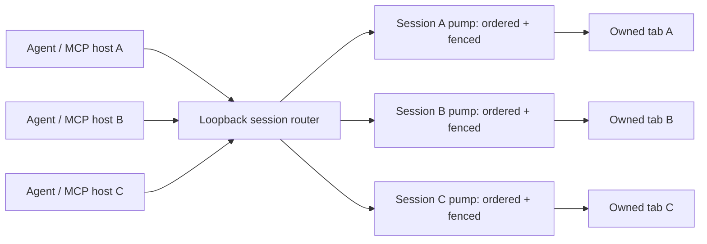

# Newton Browser / agent-browser comparative implementation audit

> Historical audit snapshot. This report compares the extension-era Newton revision
> named below. Newton's current working tree has since moved to an owned-browser direct
> CDP architecture. Use `README.md`, `ROADMAP.md`, and `docs/PROGRESS_LEDGER.md` for the
> current product boundary; retain this document only as source-attributed design history.
> `ROADMAP.md` references below are historical; current status is `docs/PROGRESS_LEDGER.md`.
> Every present-tense implementation claim below describes the pinned 2026-08-08 revision,
> not the modern direct-runtime working tree.
> The containment recommendation was later implemented and retired on 2026-08-19 after
> real-site evidence showed that it broke ordinary authentication, rendering, and controls.

- Date: 2026-08-08
- Newton Browser revision: `a6ff3066caaaad915a06cdb5c85cfd71f0c8e56a` (`0.4.5`)
- agent-browser revision: [`acbc22bdc5d4f6c5a88d97d4a4745d3c5eb0591f`](https://github.com/vercel-labs/agent-browser/tree/acbc22bdc5d4f6c5a88d97d4a4745d3c5eb0591f) (`0.33.2`)
Audit type: implementation, history, tests, transport, failure handling, security boundary, and release engineering—not a README feature comparison.

## Executive conclusion

Newton Browser should **not** become an extension-hosted clone of agent-browser. Its best ideas are already materially different and, in several areas, stronger:

- independent local-only architecture with no installed system daemon or hosted dependency;
- exact-origin session grants rather than a general-purpose automation browser;
- one owned tab/group per session, visible ownership, current-tab opt-in, and natural parallelism across agents;
- typed actions, no arbitrary JavaScript evaluation, and a two-stage structural safety floor;
- stable backend-node references, ambiguity rejection, actionability checks, and post-action verification;
- host-boundary redaction and unusually strong packed-artifact, chaos, stress, and release evidence.

The right strategy is to preserve those constraints while adapting agent-browser's most battle-tested **mechanisms**. The highest-value imports are:

1. preventive origin/network containment installed before a target can run;
2. a real per-session command pump with fencing and idempotency, while retaining cross-session parallelism;
3. dialog-aware mouse dispatch and complete keyboard semantics;
4. renderer-liveness and discarded-tab handling;
5. a frame/target session registry that supports OOPIFs, popups, and workers without weakening exact-origin grants;
6. richer accessibility snapshots while preserving Newton's stable references and conservative stale-target behavior;
7. MCP annotations, content provenance, strict action schemas, and task-level agent evaluations;
8. regression mining from agent-browser's issue-linked history and cross-platform browser lifecycle tests.

The central architectural recommendation is:

> Parallelize across sessions; serialize and fence within a session; install containment before resuming any related target; verify every mutation after dispatch.

That combines Newton's multi-agent model with agent-browser's strongest reliability lessons.

## Scope and evidence

I inspected Newton's core protocol and safety floor, MCP host and framing, loopback relay, extension transport and service worker, session controller, Chrome debugger driver, observation/ref model, action verification, redaction, configuration, tests, smoke suites, CI, release scripts, decisions, and evidence ledgers.

For agent-browser I cloned and pinned the repository, then inspected the Rust CLI and daemon, connection lifecycle, CDP client, browser/target manager, network containment, input and element resolution, accessibility/snapshot construction, policy engine, MCP implementation, content-output boundaries, doctor, tests, evaluation harnesses, benchmarks, workflows, and issue-linked Git history. The pinned revision avoids comparing a moving branch to a fixed local checkout.

Quantitative context, not a quality score:

| Signal | Newton Browser | agent-browser |
|---|---:|---:|
| Revision count at audit | 95 | 633 |
| Locally executed tests | 142 passed, 2 platform-skipped | 1,043 passed, 96 ignored |
| Current implementation style | TypeScript/JavaScript, MV3 extension + MCP host | Rust CLI + per-session daemon + owned/attached browser |
| Primary concurrency model | Many independent MCP hosts/sessions sharing one extension; one owned tab per session | Named daemon/browser sessions; commands serialized by one daemon-state mutex per session |
| Release emphasis | Packed artifact, multi-host stress/chaos, three consecutive release gates | Broad command surface, many issue regressions, real-browser and platform artifact workflows |

The test counts are not directly comparable: agent-browser has a much larger product surface, while Newton's release suite does millions of stress operations outside its 144 Node test declarations. “More mature” is justified primarily by agent-browser's longer, multi-contributor, issue-linked defect history—not by raw test count alone.

## Efficiency, agent ergonomics, and the Rust question

There are three different meanings of “efficiency” here, and they should not be collapsed:

1. **machine efficiency** — startup, memory, CPU, distribution size, and IPC overhead;
2. **agent efficiency** — tool-schema context, observation tokens, tool round trips, targeting success, and recovery from failure;
3. **engineering efficiency** — implementation speed, type coverage, portability, release burden, and defect rate.

Rust gives agent-browser a real edge in the first category and parts of the third. Its advantage in the second category mostly comes from API and output design, not Rust.

### Machine efficiency

#### What agent-browser's Rust rewrite actually improved

agent-browser's own 0.20.0 release evidence reports that replacing its former Node.js/Playwright daemon with native Rust changed:

- installed size from approximately 710 MB to 7 MB;
- daemon memory from approximately 143 MB to 8 MB;
- cold start from approximately 1,002 ms to 617 ms.

Its benchmark documentation also states that ordinary command latency is usually dominated by Chrome/CDP, so per-command Rust speedups are small; the major wins are cold start, daemon RSS, and distribution size.

Those numbers are credible evidence for agent-browser's rewrite, but they are **not an apples-to-apples forecast for Newton**. The removed implementation bundled Playwright and its dependency tree. Newton already has no Playwright, does not download a browser, and ships a roughly 92 KB MCP tarball plus a roughly 239 KB extension artifact. Its only runtime package dependency is `ws`; the larger external prerequisites are an existing Node runtime and Chrome/Edge.

#### Where Rust could still help Newton materially

Newton normally has one Node MCP host per connected client/agent. A read-only point-in-time inspection during this audit found six active Newton hosts at approximately:

| Metric | Per host | Six-host aggregate |
|---|---:|---:|
| Working set | 53.8–56.8 MB | 334.4 MB |
| Private memory | 27.8–29.3 MB | 169.8 MB |

This is not a controlled cross-language benchmark, and working set includes shared runtime pages. It does show a real scaling property: Newton's per-host V8 baseline multiplies with concurrent agents. A native stdio host/relay could plausibly reduce that baseline substantially, particularly for 8–20 simultaneous agents.

Rust would also provide:

- one native executable without a Node-version/module-resolution dependency;
- lower idle RSS and usually more predictable tail latency without V8 garbage-collection pauses;
- compiler-checked enums/state transitions and ownership around pending requests, queues, and teardown;
- cheaper high-volume parsing/redaction/hash work if those ever become bottlenecks;
- a stronger foundation for bounded queues and cancellation-safe request correlation.

But Rust does not automatically provide correct concurrency. agent-browser needed explicit serialization, rollback, backpressure, dialog, and lifecycle fixes despite being Rust. These are semantic protocol problems, not memory-safety problems.

#### Where Rust would not help much

For an ordinary observe/click/fill loop, the dominant costs are usually:

- browser rendering and accessibility-tree generation;
- CDP round trips;
- scrolling, stability sampling, hit testing, and settle conditions;
- screenshots and image transfer;
- model inference and tool-call round trips.

Shaving microseconds or a few milliseconds from JSON parsing will not materially improve a page action that takes hundreds of milliseconds. The correct first optimization is to remove unnecessary calls and waits, not to rewrite the relay.

Newton's latest recorded packed cold-start distribution was 1.866–2.009 seconds for ten fresh `npx` host processes reaching extension readiness. That includes npm launcher/process startup plus the extension handshake against an already-running browser. agent-browser's reported 617 ms includes its own daemon/browser launch on a different benchmark environment. Both are useful baselines, but comparing the numbers directly would be misleading. Newton needs a same-machine, same-browser benchmark with stage timings.

#### The MV3 ceiling on a Rust rewrite

Most Newton browser behavior lives in the MV3 extension. The session controller, driver, Chrome APIs, page/target events, input, observation, and verification run in a JavaScript service worker. Rewriting the Node MCP host in Rust would not remove JavaScript from the browser-critical path.

A full Rust rewrite would require abandoning or radically changing the extension/existing-profile architecture, which is not recommended. Compiling Rust to WebAssembly inside the extension would add a cross-language boundary, packaging complexity, and Chrome API wrappers without addressing the most important logical risks.

If Rust is adopted, the sensible boundary is:

> Native Rust stdio MCP host + loopback relay; JavaScript/TypeScript MV3 extension and driver.

That preserves the product while reducing per-agent host cost. It also creates a new risk: the host and extension safety-floor implementations could drift across languages. A canonical versioned action schema, generated types, shared conformance vectors, and cross-implementation parity tests would be mandatory.

### Agent efficiency and ease of use

Agent efficiency is best measured as **successful task completion per token and per tool round trip**, not as raw command execution speed.

#### Measured token footprint on the pinned versions

I measured the actual exposed surfaces rather than inferring token cost from tool counts. Counts use `o200k_base` as a stable estimator; another model tokenizer will differ, but the relative shape should remain similar. MCP-client behavior also matters: some clients retain or cache tool definitions, while others repeatedly place them in model context. The raw catalog numbers below therefore measure the available schema payload, not a universal per-turn bill.

For MCP discovery, I called `tools/list`, followed every pagination cursor, serialized the returned tool array as compact JSON, and counted it:

| Discovery surface | Tools | Characters | Estimated tokens |
|---|---:|---:|---:|
| Newton Browser | 11 | 4,712 | 1,061 |
| agent-browser default `core` profile | 29 | 54,557 | 11,497 |
| agent-browser `all` profile | 152 | 275,632 | 58,055 |

Newton's complete current tool catalog is therefore about **10.8x smaller** than agent-browser's default core catalog and about **54.7x smaller** than its all-tools catalog. agent-browser's pagination and profiles are good mechanisms for containing a very large surface, but they do not make its default catalog smaller than Newton's. Much of its schema weight comes from repeating shared session/configuration properties on every individually typed action tool.

I also counted the version-matched agent instructions actually served by each project:

| Instruction surface | Characters | Estimated tokens |
|---|---:|---:|
| Newton main browser skill | 6,538 | 1,474 |
| Newton main skill + its two direct references | 13,333 | 3,125 |
| `agent-browser skills get core` | 28,116 | 6,305 |
| `agent-browser skills get core --full` | 115,275 | 26,686 |

On static context, Newton already has a large advantage. Catalog plus main skill is approximately 2,535 tokens for Newton versus 17,802 for agent-browser core, before client-specific wrappers. This is precisely why Newton should not copy agent-browser's one-tool-per-operation MCP surface without measuring the schema cost.

The runtime result is different. I ran a single deterministic local-fixture workflow on the pinned builds: attach/open, discover the search controls, fill, click, verify, and close. I counted model-facing text plus the equivalent compact MCP call arguments. agent-browser used its interactive snapshot and terse command responses; Newton used full observation, its verified action envelopes/deltas, and text observation for final verification.

| Runtime payload | Newton Browser | agent-browser | Interpretation |
|---|---:|---:|---|
| Initial actionable observation | 2,462 tokens | 877 tokens | agent-browser's line-oriented snapshot is about 2.8x smaller |
| Fill result | 165 tokens | 4 tokens | Newton returns safety, verification, and delta evidence; agent-browser returns `Done` |
| Click result | 196 tokens | 4 tokens | Same evidence-versus-terseness tradeoff |
| Verification read | 263 tokens | 1,403 tokens | Newton text mode is efficient; agent-browser used a full non-interactive snapshot here and could do better with `read` or scoping |
| Whole fixture workflow, call arguments + text results | approximately 3,800 tokens | 2,451 tokens | agent-browser used about 35% fewer runtime tokens in this one workflow |

This is a one-fixture instrumentation result, not a general product benchmark. It nevertheless identifies the cause clearly: **agent-browser is currently better at compact operational rendering, while Newton is much better at static tool/instruction footprint**. Rust is not responsible for either result; JavaScript can emit the same compact representation.

Newton's full observation currently serializes each actionable node with a bounding box and both `ref` and `target: {ref}`, then adds common kind/mode/origin/title/count/time metadata. A lossless-for-current-agent-semantics prototype that removed geometry and the duplicate target and retained `{ref, role, name, value}` reduced the same observation from 2,462 tokens to 916 as lean JSON. Rendering those same Newton nodes as one compact line per element reduced it to 682 tokens. That is smaller than agent-browser's 877-token snapshot on the fixture, although agent-browser's snapshot also contains hierarchy and richer states that Newton does not yet expose.

The action path has similar avoidable duplication. Driver results carry status/verified/changed around an observation that repeats action status/verification/change data, and the MCP host adds another action status plus its policy decision. A prototype public envelope retaining `ok`, status, policy decision, changed facts, and non-empty delta entries reduced the measured fill response from 165 to 89 tokens and click from 196 to 112 tokens. It does not need to collapse to agent-browser's four-token `Done`; Newton's safety evidence is valuable. It only needs one canonical copy.

With the compact line observation and deduplicated action envelopes substituted into the measured Newton workflow, its estimated total falls to roughly 1,900 tokens, below the agent-browser run, without removing exact-origin scope, floor decisions, action status, changed facts, or recovery deltas. This is an implementation target, not a result the current product achieves.

#### What to borrow specifically for token efficiency

1. **Add a compact agent rendering for observations.** Keep raw JSON as an explicit diagnostic format, but make the normal model view a short header plus one line per actionable element. Omit geometry unless requested, omit `target: {ref}` because `ref` is sufficient, and omit timestamps unless evidence/debug mode needs them.
2. **Deduplicate public action results at the MCP boundary.** Return one status, one decision, one changed object, and one bounded delta. Keep richer internal driver/controller structures private.
3. **Expose observation scoping already partly present in the driver.** The driver accepts an accessible-name `query`, but `browser.observe` neither declares nor forwards it. Add it, then evaluate role filters and a structure/interactive choice. Borrow the principle behind agent-browser's selector/depth/compact flags, not unrestricted page selectors by default.
4. **Combine session start with the first observation.** An optional bounded `observe` request on `browser.session.start` removes a model/tool round trip and avoids repeated session/origin metadata.
5. **Make compact status the common path.** `browser.status` is approximately 250 tokens on the measured ready host. A compact readiness/version/skew response is enough for ordinary startup; retain full diagnostics on request.
6. **Keep and teach `mode: "text"`.** It was only 263 tokens on the fixture and is the right default for reading or verifying prose. Improve its document outline/link semantics before adding a separate fetch path.
7. **Add output budgets and task replay evals.** Check catalog characters/tokens, observation cost by fixture size, action-result cost, total tool calls, repair calls, and success. Tokenizers belong in development/CI evaluation, not the local runtime product.
8. **Do not blindly adopt dozens of typed tools.** Evaluate a concise discriminated action schema or a handful of high-frequency aliases against the current 1,061-token catalog baseline. An ergonomic improvement that adds ten thousand static tokens may be a net loss.

The most useful product metric is not simply output tokens. Track **tokens to verified completion**: schema/instruction context, tool-call arguments, tool results, failed/repair calls, and the final verified outcome. A terse `Done` is cheap only when it does not force another snapshot or unsafe retry.

#### Where Newton is already more efficient for agents

- **Small discovery surface.** Newton exposes 11 MCP tools. agent-browser's much larger surface needs a default `core` profile, composed profiles, and paginated tool discovery to control context size.
- **Stable refs.** Newton's backend-node refs can survive repeated observations while the node survives, reducing re-targeting work.
- **Action deltas and verification.** An action returns its verified status and observation delta. Agents can often inspect `changed`/delta instead of reflexively taking another full snapshot.
- **Safe form batching.** `fill_form` removes repeated MCP round trips while still evaluating every field and stopping before a sensitive/failed field.
- **Explicit recovery semantics.** `ambiguous`, `stale_target`, `target_moved`, `dispatched_unverified`, and origin/floor decisions are more useful than a generic failure and can prevent unsafe retries.
- **Immediate existing-profile context.** For authenticated tasks, an owned tab in the user's existing profile avoids a separate login/state-restoration workflow while preserving the prohibition on credential inspection.
- **Session isolation.** Distinct session IDs, owned tabs, and instance labels make concurrent-agent ownership explicit instead of relying on a global “current page.”

These are meaningful token and reliability wins. They should be made more visible in the skill and tool results so agents actually exploit them.

#### Where agent-browser is easier for agents

agent-browser has invested heavily in the agent-facing layer:

- common operations have distinct typed MCP tools (`open`, `snapshot`, `click`, `fill`, `type`, `press`, `wait`, `screenshot`) rather than one generic nested action object;
- `snapshot -i` and compact/depth/selector modes let an agent request only the context it needs;
- snapshots expose checked/selected/expanded/disabled/required states, hrefs, landmarks, and cursor-interactive elements;
- annotated screenshots put visual labels and refs in the same evidence surface;
- stable tab IDs/labels avoid positional-tab mistakes;
- CLI JSON, command chaining, and batch execution reduce shell/process round trips;
- its `read` command prefers Markdown/`llms.txt`-style content where available, avoiding an expensive rendered-tree workflow for prose;
- errors increasingly name the failed locator or blocking overlay and suggest a recoverable next step;
- MCP startup profiles and pagination keep its large typed surface from consuming all context;
- dedicated evals measure command usage, skill selection/loading, and MCP context footprint.

This is the area where Newton has the most to borrow for day-to-day usability.

#### Current Newton friction

A normal Newton workflow is deliberately explicit:

`browser.status -> browser.session.start(origin) -> browser.observe -> browser.act -> finalize`.

That costs more initial calls than agent-browser's auto-launching `open -> snapshot -> act`. Some of the friction is valuable: exact origin, ownership, and final disposition should not disappear. Other parts can be compressed safely:

- `browser.session.start` could optionally return the first observation after attachment;
- high-frequency actions need stricter, more discoverable schemas;
- the skill should state when an action delta is sufficient and a full re-observe is unnecessary;
- observation nodes need state/href/frame context so agents do not make diagnostic follow-up calls;
- screenshots need ref-linked annotations for multimodal targeting;
- common error results need a typed `nextAction` and bounded blocker metadata;
- session startup currently has a visible ~2 second fresh-host budget and should expose timing stages.

The generic `browser.act.action` schema is the largest tool-usability weakness. Runtime parsing supports many actions, but MCP discovery exposes the nested action as a generic object. Models must learn the action grammar from the skill/reference instead of the tool schema, and invalid fields can be silently dropped or defaulted.

Do not immediately replace it with dozens of tools. Evaluate three surfaces:

1. one strict discriminated `browser.act` union;
2. 6–10 typed high-frequency tools plus one advanced action tool;
3. selectable MCP tool profiles.

Measure task success, schema tokens, invalid calls, tool-selection errors, and round trips. Choose the smallest surface that produces reliable tool calls.

### High-value agent-efficiency improvements

Ordered by likely impact:

1. **Compact observation rendering.** Strip default geometry/duplicate targets and render the current actionable semantics in a line-oriented model view; retain explicit JSON/geometry diagnostics.
2. **Canonical compact action envelope.** Preserve safety and verification, but emit status/decision/changed/delta once.
3. **Initial-observation session start.** Optional `observe: {mode, maxNodes, maxChars, query, format}` saves one call while retaining exact-origin attachment.
4. **Observation scoping.** Expose the driver's existing query path, then add evaluated interactive/structure/role filters.
5. **Strict discoverable action schemas.** Reject unknown/ill-typed fields; give high-frequency operations schema visibility without surrendering the small-catalog advantage.
6. **Richer compact observation semantics.** Add state, sanitized href, element type, frame provenance, and truncation reason only where they improve completion enough to justify their token cost.
7. **Ref-linked annotated screenshots.** Render labels in the capture pipeline without mutating application DOM.
8. **Use action deltas as the normal feedback loop.** Return enough bounded changed-node context that re-observation is reserved for navigation, stale refs, major rerenders, or explicit inspection.
9. **Bounded action batches after the command pump exists.** Permit a small same-session batch with per-action floor evaluation, ref/document epoch checks, stop-on-first-failure, and no commit/external-effect actions by default. Keep `fill_form` as the specialized safe form path.
10. **Teaching errors.** Include `nextAction`, blocker identity, current/ref epoch, and whether retry is safe.
11. **Stage timings and token budgets.** Report host queue, extension queue, CDP, settle, observation, redaction, transfer durations, schema tokens, and result tokens so optimization targets evidence rather than intuition.
12. **Agent-loop evals.** Compare total calls/tokens/time for login-preserving navigation, form work, SPA rerender, dialog, popup, iframe, screenshot, and three-agent parallel tasks.

Do not copy agent-browser's direct Markdown HTTP reader into Newton without a product decision: a separate outbound fetch bypasses the controlled existing-profile tab and its exact-origin/session evidence. Newton can instead improve `observe mode:text`, add rendered-document outline/filter options, and use page-declared alternate representations only through explicitly granted browser navigation.

### Engineering efficiency and maintainability

Rust's compiler covers agent-browser's daemon logic, but its codebase also demonstrates a tradeoff: `actions.rs` has grown beyond 14,000 lines. Native code does not guarantee modularity or easier maintenance.

Newton has a more immediate type-safety issue: strict TypeScript covers `*.ts`, but the critical [`driver.js`](https://github.com/Koala-Studios/newton-browser/blob/a6ff3066caaaad915a06cdb5c85cfd71f0c8e56a/packages/driver/src/driver.js) and [`controller.js`](https://github.com/Koala-Studios/newton-browser/blob/a6ff3066caaaad915a06cdb5c85cfd71f0c8e56a/packages/driver/src/controller.js) files are copied verbatim into the extension build and are excluded from `tsconfig.json`. Before a language rewrite, convert them to TypeScript or enable checked JSDoc/`checkJs`. This would catch action/result/session drift at far lower cost.

JavaScript/TypeScript advantages for Newton:

- native fit for MV3 and `chrome.*` APIs;
- fast iteration and debugging in the actual service-worker environment;
- simpler contributor/build setup and one extension language;
- tiny source/package artifacts and no native cross-compilation;
- easier sharing of protocol types, redaction rules, and risk fixtures between host and extension.

Rust host disadvantages:

- separate implementations of protocol/risk/redaction unless generation is introduced;
- seven-or-more platform artifact, signing, provenance, and installation paths;
- slower compile/test cycles and a smaller likely contributor pool;
- platform-specific native lifecycle issues, as agent-browser's Windows install/port/ARM history demonstrates;
- more complex debugging across Rust stdio/relay and JavaScript extension boundaries.

### Recommendation on Rust

Do **not** rewrite Newton in Rust now. First implement the correctness work in this report and instrument the pipeline. Reconsider a Rust MCP host/relay when one or more evidence thresholds are crossed:

- expected production use regularly exceeds 8 concurrent host processes;
- aggregate private host memory exceeds a defined product budget (for example 256 MB) before browser memory;
- P95 non-browser overhead exceeds 20 ms per command after Node-path optimization;
- Node installation/version problems are a significant share of setup failures;
- startup targets cannot be met without avoiding `npx`/Node process cost.

At that point, run a same-protocol bake-off:

- Node host versus Rust host;
- same machine, Chrome/Edge version, extension, fixture, and session count;
- 1/4/8/16 concurrent agents;
- cold/warm start, idle/private/peak RSS, CPU, queue latency, screenshot throughput, and 30-minute stress;
- exact result and safety-floor parity vectors.

If Rust wins the defined budgets, replace only the MCP host/relay and retain the MV3 driver. Until then, the higher-return work is typed driver code, fewer agent round trips, richer compact observations, and deterministic session execution.

## Product and architecture comparison

| Dimension | Newton Browser | agent-browser | Direction for Newton |
|---|---|---|---|
| Product boundary | Existing-profile Chromium control through an MV3 extension and local MCP host | General browser automation CLI/MCP with launch, attach, providers, storage/auth, plugins, recording, streaming, and more | Keep Newton's narrow boundary |
| Browser ownership | Existing Chrome/Edge profile; owned inactive tab by default; current tab explicit | Usually launches/owns a browser; can attach to existing CDP/providers | Do not adopt launch/provider architecture |
| Session scope | Required exact HTTP(S) origin plus explicit exact allowed origins | Browser session plus optional hostname allowlist | Keep exact origins; borrow earlier enforcement |
| Multi-agent work | Independent hosts and sessions can operate concurrently with isolated owned tabs/groups | Named sessions isolate daemon/browser state; one daemon mutex serializes each session | Keep Newton topology; add explicit per-session serialization |
| Authorization | Structural typed-action floor; page prose is never authority; sensitive fields blocked | Coarse allow/deny/confirm policy by command | Keep structural floor; optionally add a deny/allow overlay |
| Arbitrary evaluation | Deliberately absent | First-class `eval` | Do not borrow |
| Observation | Compact actionable AX nodes, stable backend-node refs, text mode, diff | Rich AX tree, states/hrefs, cursor-interactive discovery, filters, frames | Enrich Newton's model without abandoning stable refs |
| Action success | Verifies state change and reconciles signals | Many commands report successful dispatch; increasingly adds targeted reliability checks | Keep Newton verification; borrow lower-level dispatch mechanics |
| Origin escape | Reconciles live origin before/after command and closes escaped owned session | Fetch interception + page/worker patches + paused target attachment + WebRTC restriction | Add preventive containment to Newton |
| Privacy | No cookies/storage/profile files/password inspection; result redaction and screenshot masks | Exposes cookies, storage state, auth profiles, eval, network features | Do not borrow invasive capabilities |
| Transport | MCP stdio; optional single-client Unix continuity; 127.0.0.1 relay | CLI-to-daemon Unix socket or Windows loopback TCP; MCP facade | Keep Newton's MCP-first transport |
| Release | Strong packed and clean-user gate, chaos/stress, deterministic extension ZIP | Seven platform binaries, provenance, broad real-browser/platform checks | Combine both strengths |

### What “multi-agent” should continue to mean

Newton's concurrency is not merely a named-session flag. The loopback bridge can coordinate multiple independent MCP host instances, atomically select one eligible Chrome/Edge extension owner per session, and bind each session to a separate owned tab/group. This is a useful product-level distinction from agent-browser's named daemon sessions.

The missing invariant is inside one Newton session. [`controller.js`](https://github.com/Koala-Studios/newton-browser/blob/a6ff3066caaaad915a06cdb5c85cfd71f0c8e56a/packages/driver/src/controller.js#L329) passes each incoming callback directly to async `runCommand`; the WebSocket and extension event surfaces can deliver another callback while the first is awaiting CDP. The driver itself has one mutable `activeActionSignals` slot in [`driver.js`](https://github.com/Koala-Studios/newton-browser/blob/a6ff3066caaaad915a06cdb5c85cfd71f0c8e56a/packages/driver/src/driver.js#L1474), so overlapping commands can mix signal windows and input sequences. A comment says the “per-session command pump” serializes calls, but no such pump exists.

agent-browser's daemon accepts concurrent client connections but holds a Tokio mutex across command execution in [`daemon.rs`](https://github.com/vercel-labs/agent-browser/blob/acbc22bdc5d4f6c5a88d97d4a4745d3c5eb0591f/cli/src/native/daemon.rs#L505). Newton should borrow the invariant, not the global shape:



All three pumps may run concurrently. Only commands targeting the same session are ordered. This preserves the intended multi-agent throughput and makes action signals, dialogs, ref epochs, timeouts, and finalization deterministic.

## Newton strengths to retain

### 1. Exact-origin, visible session ownership

[`browser.session.start`](../apps/mcp-server/src/mcp-server.ts#L106) requires a normalized HTTP(S) origin. The extension validates the live tab before binding, rechecks it before every command, and rechecks after every action. Owned tabs are grouped/labeled and do not steal the user's active tab. Current-tab control is explicit and reconciled against the grant.

agent-browser's domain filter is valuable, but it is hostname-oriented and belongs to a broader browser-owning product. Newton should retain scheme + host + port exactness and its explicit list of allowed origins.

### 2. Structural safety floor and typed actions

Newton evaluates risk first from host-known action structure and again from driver-resolved element facts. Sensitive credential, payment, government-ID, and OTP fields are blocked before input. Commit and external-effect shapes are surfaced without treating page-authored prose as authorization. Arbitrary evaluation is intentionally absent, as documented in [`DECISIONS.md`](DECISIONS.md#L222).

agent-browser's [`policy.rs`](https://github.com/vercel-labs/agent-browser/blob/acbc22bdc5d4f6c5a88d97d4a4745d3c5eb0591f/cli/src/native/policy.rs#L83) is a useful user-configurable overlay, but command-name allow/deny/confirm cannot replace element-aware classification. If adopted, deny must take precedence and the structural floor must remain the non-bypassable lower layer.

> Superseded by the modern direct-runtime collapse: Newton has no approval protocol, so
> the unused `approval_required` compatibility class was removed. Commit risk is now
> expressed only by `decision.commitBoundary`; blocked actions remain explicitly blocked.

### 3. Stable references, ambiguity rejection, and actionability

Newton's `e<backendNodeId>` references persist across observations while the DOM node survives. Resolution rejects multiple matches, checks attachment and stability, scrolls into view, computes multiple candidate points, and hit-tests the actual target/descendant before input. These properties are stronger than silently choosing a plausible match.

agent-browser assigns compact per-snapshot refs and can heal stale refs from role/name/nth metadata. That is convenient but can retarget a mutation after the page changes. Newton should not silently adopt it. An optional future “healed target” path should require a strong fingerprint and return an explicit `retargeted: true` result so callers can decide whether to proceed.

### 4. Post-action verification

Newton measures pre/post element and page state and returns `verified`, `dispatched_unverified`, `not_found`, `ambiguous`, `stale_target`, `timed_out`, or `failed`. It also reports navigation, dialog, download, new-target, and network-write signals. This is a major product advantage over a simple “CDP acknowledged the command” success contract.

The improvement is to make prevention and dispatch more reliable—not to replace verification.

### 5. Privacy and local-only boundary

Newton never inspects cookies, storage, browser profile files, saved passwords, or credentials. It strips URL queries/fragments, redacts text and node values at the host boundary, never returns network headers, bounds response bodies, and can mask configured screenshot regions before pixels cross the relay.

Do not import agent-browser's cookie, storage-state, credential-profile, arbitrary-eval, cloud-provider, or browser-profile features. Those are valid for its product and incompatible with Newton's stated boundary.

### 6. Release engineering

Newton's [`release:check`](../scripts/release-check.mjs) builds, lints, typechecks, tests, creates the extension artifact, checks packed installs, and runs matrix, chaos, multi-client, and clean-user smokes. The release evidence records three consecutive unshortened packed gates with millions of measured operations, no cross-session results, no deadlocks, deterministic artifact hashes, and no orphan relay ports.

Do not weaken this gate in pursuit of agent-browser feature parity. Add agent-browser-style cross-platform lifecycle regressions to it.

## Priority findings and borrowing plan

### P0 — Add a per-session command pump, result fencing, and idempotency

**Observed Newton state**

- The bridge caps global pending commands and queues only while a session lacks a subscriber; subscribed sessions do not have a per-session in-flight cap in [`bridge.ts`](https://github.com/Koala-Studios/newton-browser/blob/a6ff3066caaaad915a06cdb5c85cfd71f0c8e56a/apps/mcp-server/src/bridge.ts#L447).
- The extension subscription invokes `runCommand` directly for every callback.
- The driver has one mutable action-signal window and dispatches multi-event mouse/key sequences without a session lock.
- `ActInput.idempotencyKey` is declared in [`protocol.ts`](../packages/core/src/protocol.ts#L398) but has no implementation use.
- When a host command times out, its pending entry is removed, but there is no cancellation or sequence fence preventing the extension from finishing it later. A retry could duplicate a mutation.

**Borrow/adapt from agent-browser**

- Borrow per-session serialization from its daemon-state mutex.
- Borrow its CDP pending-entry cleanup pattern from [`client.rs`](https://github.com/vercel-labs/agent-browser/blob/acbc22bdc5d4f6c5a88d97d4a4745d3c5eb0591f/cli/src/native/cdp/client.rs#L52).
- Do **not** copy its blind transient whole-command retry loop. A lost response after a successful mutation can make a replay unsafe.

**Newton design**

Create one `SessionCommandPump` per controller:

- FIFO for action, observe, screenshot, focus, trusted fill, and finalize;
- bounded queue length and total queued bytes;
- session epoch + monotonic sequence number on every dispatch/result;
- finalization closes the queue and fences all earlier/later work;
- terminal result ledger keyed by `idempotencyKey`, with in-flight dedupe and bounded TTL/LRU;
- timeout produces `outcome_unknown` unless the pump can prove the action never began;
- late results from an old epoch are logged and discarded, never attached to a newer request;
- fair scheduling across session pumps, with no global action mutex.

**Required regression evidence**

1. Two concurrent clicks in one session execute in arrival order with non-overlapping input sequences.
2. Two sessions continue in parallel while one session waits.
3. Duplicate idempotency keys return one cached terminal result and dispatch once.
4. Timeout after dispatch returns `outcome_unknown`; retry does not redispatch.
5. Finalize races with action: exactly one defined ordering, no orphan tab/session.
6. Signal windows never contain events from another command.

### P0 — Make origin containment preventive, not only detective

**Observed Newton state**

Newton rechecks the tab origin before and after commands and closes an owned session after an escape. That prevents continued reading/control, but it does not prevent the first disallowed request:

- `navigate` issues `Page.navigate` before controller reconciliation in [`driver.js`](https://github.com/Koala-Studios/newton-browser/blob/a6ff3066caaaad915a06cdb5c85cfd71f0c8e56a/packages/driver/src/driver.js#L600);
- target auto-attach currently uses `waitForDebuggerOnStart: false` in [`driver.js`](https://github.com/Koala-Studios/newton-browser/blob/a6ff3066caaaad915a06cdb5c85cfd71f0c8e56a/packages/driver/src/driver.js#L98);
- popup, worker, iframe, click-driven navigation, and network-write signals are primarily detected after the fact;
- a result described as `blocked` after a network write or target creation can mean “detected after effect,” not “prevented.”

**Borrow/adapt from agent-browser**

agent-browser has accumulated a particularly valuable chain of containment fixes. Its current code:

- applies browser/page auto-attach with `waitForDebuggerOnStart: true` in [`browser.rs`](https://github.com/vercel-labs/agent-browser/blob/acbc22bdc5d4f6c5a88d97d4a4745d3c5eb0591f/cli/src/native/browser.rs#L698);
- installs Fetch interception plus defense-in-depth API patches for pages, frames, and workers in [`network.rs`](https://github.com/vercel-labs/agent-browser/blob/acbc22bdc5d4f6c5a88d97d4a4745d3c5eb0591f/cli/src/native/network.rs#L457);
- blocks WebRTC as a bypass while filtering is active;
- rejects configurations where controls cannot be installed before profile/state/provider activity in [`actions.rs`](https://github.com/vercel-labs/agent-browser/blob/acbc22bdc5d4f6c5a88d97d4a4745d3c5eb0591f/cli/src/native/actions.rs#L2723).

Its Git history shows why this needs system treatment rather than one patch: popup, ordinary worker, module-worker, worker-WebSocket, CSP bootstrap, restored-state, profile, provider, and WebRTC bypasses were fixed in separate reviews.

**Newton design**

1. Preflight any action URL against exact allowed origins before dispatch.
2. Attach related targets paused; build target/frame/session metadata; recursively enable auto-attach on each child target; install exact-origin Fetch rules; then call `Runtime.runIfWaitingForDebugger`.
3. Intercept top-level documents, subframes, worker fetches, WebSocket/EventSource/beacon equivalents, and popup initial requests.
4. Decide and document whether the grant restricts only controlled documents or all network egress. If it means all egress, account for subresources and WebRTC explicitly. If it means controlled origins only, do not claim network isolation.
5. Keep current pre/post origin reconciliation as defense in depth.
6. Replace ambiguous post-effect `blocked` results with `prevented` versus `effect_detected`/`outcome_unknown` semantics.
7. Fail closed if the extension/CDP surface cannot install containment early enough.

The Chrome DevTools Protocol explicitly supports paused auto-attach and resumption with `Runtime.runIfWaitingForDebugger`, and Fetch interception pauses a request until the client continues, fulfills, or fails it. Those are the appropriate primitives—not arbitrary sleeps.

**Required regression evidence**

- explicit navigate to an ungranted origin causes zero server request;
- 30x redirect to an ungranted origin is stopped before the target commits;
- `window.open`, same-process iframe, OOPIF, dedicated/shared/module worker, WebSocket, EventSource, and beacon cases;
- popup first request cannot race installation;
- allowed-origin traffic continues normally;
- current-tab mode fails closed without closing a user-owned tab;
- no target remains paused after session teardown.

### P0 — Make mouse dispatch dialog-aware

**Observed Newton state**

Newton sends `mouseMoved`, `mousePressed`, and `mouseReleased` and awaits each CDP acknowledgement. A synchronous `alert`, `confirm`, or `prompt` in a mouse handler can pause the renderer before the acknowledgement returns. Newton records dialog events, but the click awaits the command and can time out before returning the pending-dialog information. If the dialog opens on `mousedown`, the logical button release is also left unresolved.

**Borrow nearly directly from agent-browser**

[`dispatch_mouse_or_dialog`](https://github.com/vercel-labs/agent-browser/blob/acbc22bdc5d4f6c5a88d97d4a4745d3c5eb0591f/cli/src/native/interaction.rs#L943) subscribes before sending input and races the command acknowledgement against a session-scoped `Page.javascriptDialogOpening` event. It records a pending release if the dialog opened after press and emits that release after the dialog is resolved.

Adapt this to `chrome.debugger` event delivery and Newton's target registry. The acceptance set must include only the top page and frame sessions involved in this click; a background tab's dialog must not cancel the wrong input.

**Tests**

- dialog from `mousedown`, `mouseup`, and `click`;
- top page versus OOPIF versus unrelated tab;
- accept and dismiss both release a held button;
- command returns pending dialog before the CDP timeout;
- no duplicate release and no stuck `buttons` state.

### P0 — Make session creation transactional

**Observed Newton defect**

In local [`startSession`](https://github.com/Koala-Studios/newton-browser/blob/a6ff3066caaaad915a06cdb5c85cfd71f0c8e56a/packages/driver/src/controller.js#L94), the host session is created and inserted into `sessions` before driver attachment and live-origin verification. If attach or verification throws, the catch block removes the owned tab but does not remove the controller, detach a partial debugger, or call `transport.stopSession`. This can leave a host session/controller referencing a closed tab.

agent-browser recently added atomic attach rollback and explicit tests around this seam. Newton should implement a small transaction/state machine:

`creating_host -> creating_tab -> attaching_debugger -> verifying_origin -> publishing_ready`.

Every failure path must unwind only completed stages in reverse order. Do not expose the session to command routing until `publishing_ready` succeeds.

**Tests**

- host create succeeds, driver attach fails;
- attach succeeds, live-origin check fails;
- attachTab relay fails;
- subscription setup fails;
- cleanup itself partially fails;
- worker restart during each stage;
- every case proves no session, debugger attachment, binding record, owned tab, or queued command remains.

### P1 — Add a target/frame/session registry and OOPIF support

**Observed Newton state**

Newton can include same-origin iframe AX trees and correctly translates page coordinates, but excludes cross-origin frames and does not route CDP commands through child session IDs. `Target.setAutoAttach(flatten: true)` is enabled, yet attached-target session metadata is not promoted to a driver-wide registry.

agent-browser maintains `frameId -> CDP sessionId` mappings in its browser, accessibility, snapshot, and element layers. Its [`element.rs`](https://github.com/vercel-labs/agent-browser/blob/acbc22bdc5d4f6c5a88d97d4a4745d3c5eb0591f/cli/src/native/element.rs#L304) resolves a ref against the correct frame session and handles OOPIF hit testing.

**Newton design**

- registry entry: target ID, session ID, type, parent target, frame ID, parent frame, origin, lifecycle state, waiting state, and session epoch;
- route CDP through an explicit target session;
- recursively auto-attach because Chrome only attaches targets known to each immediate parent;
- declare/enforce a Chrome/Edge version floor that supports flat child debugger sessions (Chrome 125+), or fail the child-target feature closed;
- stable ref identity becomes composite (`document/frame epoch + backendNodeId`), avoiding cross-process collisions;
- observe/interact only if that frame's exact origin is granted;
- surface excluded frames as bounded metadata rather than silently pretending they do not exist;
- tear down detached target refs immediately;
- workers participate in containment but never in the element tree.

### P1 — Enrich observations without copying unsafe details

agent-browser's snapshot model is significantly richer. [`snapshot.rs`](https://github.com/vercel-labs/agent-browser/blob/acbc22bdc5d4f6c5a88d97d4a4745d3c5eb0591f/cli/src/native/snapshot.rs#L78) captures checked, expanded, selected, disabled, required, level, value, href, duplicate/nth, frame, and cursor-interactive hints; it offers interactive/compact/depth/selector views.

Newton should add, in order:

1. checked/selected/expanded/disabled/required/level/value-state fields;
2. sanitized same-origin href destination and element type;
3. frame/document provenance and ref epoch;
4. structural landmarks/headings when requested;
5. an optional interactive heuristic for elements missing from AX.

Keep Newton's bounded JSON and stable refs. Do not copy agent-browser's cursor discovery verbatim: it temporarily writes `data-__ab-ci` attributes into the page in [`snapshot.rs`](https://github.com/vercel-labs/agent-browser/blob/acbc22bdc5d4f6c5a88d97d4a4745d3c5eb0591f/cli/src/native/snapshot.rs#L624). Even though it cleans them up, page-observable mutations can trigger observers or collide with application logic. Prefer DOM domain traversal or an isolated-world computation that does not alter the main DOM.

Add output-cost metrics: nodes scanned, nodes returned, serialized bytes, capture duration, and truncation reason. This supports agent-loop efficiency without sacrificing detail.

### P1 — Fix typing semantics and selector errors

Newton's `fill` correctly uses `Input.insertText`, but `type` sends printable characters as `Input.dispatchKeyEvent` with only `type` and `text`. agent-browser moved printable text to `Input.insertText` after Electron/VS Code-style surfaces rejected incomplete key event descriptions. It retains full key/code/virtual-key fields for shortcuts and control keys in [`interaction.rs`](https://github.com/vercel-labs/agent-browser/blob/acbc22bdc5d4f6c5a88d97d4a4745d3c5eb0591f/cli/src/native/interaction.rs#L120).

Adapt the split:

- printable Unicode and IME-like text: `Input.insertText`;
- Enter, Tab, arrows, Escape, Delete, function keys, and chords: complete `dispatchKeyEvent` descriptors;
- preserve `type` versus `fill` semantics by whether existing content is selected/cleared, not by using a less reliable text protocol.

Newton's selector wait also treats invalid CSS as “not found until timeout.” Return a typed `invalid_selector` immediately, as agent-browser now does, and include the parser message only after redaction/bounding.

### P1 — Handle discarded/background-tab lifecycle explicitly

Newton deliberately keeps owned tabs inactive, making renderer lifecycle especially important. A discarded renderer can keep a tab/session identity while never answering renderer-bound CDP commands. A JavaScript dialog can create a similar timeout but requires a different recovery.

agent-browser now uses bounded liveness probes, skips discarded first targets, revives only when appropriate, and distinguishes dialog-blocked from discarded tabs in [`browser.rs`](https://github.com/vercel-labs/agent-browser/blob/acbc22bdc5d4f6c5a88d97d4a4745d3c5eb0591f/cli/src/native/browser.rs#L747). Its issue-linked regressions cover switch, close-successor, connect, and all-discarded cases.

Newton should:

- set owned tabs `autoDiscardable: false` where the extension API supports it;
- still probe renderer liveness at attach/rebind and after relevant detach/errors;
- classify `dialog_blocked`, `discarded`, `target_gone`, `debugger_conflict`, and `renderer_unresponsive` separately;
- use event/state transitions for recovery, not a wider generic timeout;
- preserve the user's active tab when recovering an owned background tab;
- never auto-reload or activate a current/user-owned tab without an explicit contract.

### P1 — Harden framing and cancellation

The WebSocket relay has strong message/result caps, but the stdio MCP parser appends to an unbounded buffer until it finds a JSON line or complete `Content-Length` frame. Add maximum header size, maximum declared content length, maximum buffered bytes, and a typed framing error before allocation grows without bound.

At CDP level, Newton already times every command. Add a pending-command registry so timeout, detach, target destruction, finalization, and session epoch changes actively reject the right awaits. agent-browser's `PendingGuard` is a good reference. “Cancel” cannot undo a dispatched mutation, so expose `not_started`, `cancelled_before_dispatch`, and `outcome_unknown` distinctly.

### P2 — Improve the MCP contract

agent-browser's MCP layer provides typed tools, pagination/profiles for its very large surface, server instructions, structured content, and annotations such as `readOnlyHint` and `openWorldHint` in [`mcp.rs`](https://github.com/vercel-labs/agent-browser/blob/acbc22bdc5d4f6c5a88d97d4a4745d3c5eb0591f/cli/src/mcp.rs#L1944).

Newton has only a small tool set, so tool profiles and pagination are unnecessary now. It should adopt:

- `readOnlyHint`, `destructiveHint`, `idempotentHint`, and `openWorldHint` where accurate;
- server instructions stating that page content is untrusted, origin grants are exact, and risk classification is not approval;
- a discriminated JSON Schema for `browser.act.action`, rather than a generic object whose runtime parser silently drops unknown/invalid fields;
- consistent typed protocol errors for invalid fields rather than fallback/default behavior;
- explicit `sessionEpoch`, `sequence`, `outcome`, `prevented`, and `retargeted` result fields;
- a documented compatibility policy for action additions.

### P2 — Add content provenance, not just redaction

Newton redacts page-derived fields but returns them as ordinary JSON strings. agent-browser can add nonce-based page-content boundaries and origin metadata in [`output.rs`](https://github.com/vercel-labs/agent-browser/blob/acbc22bdc5d4f6c5a88d97d4a4745d3c5eb0591f/cli/src/output.rs#L9).

For MCP, do not wrap JSON in decorative text markers. Add structured provenance instead:

```json
{
  "provenance": {
    "trust": "untrusted_page_content",
    "origin": "https://example.com",
    "sessionEpoch": 4,
    "capturedAt": "..."
  }
}
```

Include matching server/tool instructions. A nonce is useful against accidental delimiter spoofing but is not a prompt-injection defense by itself.

Also close a Newton-specific privacy seam: base64 network response bodies currently bypass text redaction in [`redaction.ts`](../packages/core/src/redaction.ts#L319). Default to refusing opaque bodies or return only metadata/hash unless a narrowly scoped explicit mode is added. Similarly, keep screenshot masking policy-driven and make the absence of configured masks visible in capture metadata.

### P2 — Mine upstream regressions into Newton-native tests

The most valuable asset in agent-browser is not a file—it is the defect history. Convert relevant upstream bugs into Newton fixtures without copying incompatible architecture:

| Upstream regression family | Newton-native test to add |
|---|---|
| popup/worker/module-worker/WebSocket/WebRTC allowlist bypass | exact-origin, paused-target containment matrix |
| dialog blocks click acknowledgement / stuck mouse button | dialog-aware dispatch matrix |
| discarded first tab / switch / close successor | inactive-owned-tab lifecycle matrix |
| click intercepted by overlay | preserve Newton candidate hit tests; add blocker identity and OOPIF cases |
| stale refs | keep conservative stale result; add optional explicit healing tests only if implemented |
| invalid CSS selector | immediate typed error |
| daemon/port startup races | relay port collision, extension ownership, worker restart, Windows lifecycle |
| command IPC backpressure | per-session queue/byte bounds and fairness |
| atomic attach rollback | session transaction tests |
| delayed waits and timeout resend | state-transition waits and no mutation replay |

Every imported defect should follow Newton's required format: deterministic repro, root cause, regression, and evidence row.

#### Upstream regression watchlist

These implementation changes are especially useful starting points for Newton issues and tests. Reference the behavior and review discussion; reimplement against Newton's invariants.

| agent-browser change | Lesson to carry into Newton |
|---|---|
| [`ce68e2c` — WebRTC allowlist bypass](https://github.com/vercel-labs/agent-browser/commit/ce68e2c) | Network containment must account for paths outside ordinary Fetch interception |
| [`74f8058` — page-created popup bypass](https://github.com/vercel-labs/agent-browser/commit/74f8058) | A popup's first request must not run before policy is installed |
| [`3cbaeee` — worker target filtering](https://github.com/vercel-labs/agent-browser/commit/3cbaeee) | Containment belongs on child worker sessions, not only the page |
| [`74259f7` — module-worker bootstrap](https://github.com/vercel-labs/agent-browser/commit/74259f7) | Worker bootstrap mode and CSP can invalidate an otherwise sound injection plan |
| [`6f827a4` — worker WebSocket bypass](https://github.com/vercel-labs/agent-browser/commit/6f827a4) | Test every network API in every relevant execution target |
| [`302bdb0` — CSP-blocked worker bootstrap](https://github.com/vercel-labs/agent-browser/commit/302bdb0) | Fail closed when defense-in-depth installation cannot be proven |
| [`01582e3` — restored-state replay bypass](https://github.com/vercel-labs/agent-browser/commit/01582e3) | Restored/pre-existing state can run before runtime policy; Newton should keep state restore out of scope |
| [`c4fc782` — atomic attach rollback](https://github.com/vercel-labs/agent-browser/commit/c4fc782) | Treat session publication as a transaction with tested reverse cleanup |
| [`f680354` — live target selection](https://github.com/vercel-labs/agent-browser/commit/f680354) | Never enable renderer domains blindly on the first/discarded target |
| [`1ed371f` — discarded-tab switch](https://github.com/vercel-labs/agent-browser/commit/1ed371f) | Detect renderer liveness and recover by state, not by widening timeouts |
| [`25d724b` — dialog-blocked target handling](https://github.com/vercel-labs/agent-browser/commit/25d724b) | A timeout probe must distinguish a paused live renderer from a discarded one |
| [`4526722` — dialog scoping/stuck button/timeout review](https://github.com/vercel-labs/agent-browser/commit/4526722) | Subscribe before input, scope dialog events, and repair a pressed mouse button |
| [`688e285` — click interception](https://github.com/vercel-labs/agent-browser/commit/688e285) | Report the actual blocking overlay; preserve Newton's stronger candidate-point checks |
| [`83e4151` — invalid CSS errors](https://github.com/vercel-labs/agent-browser/commit/83e4151) | Invalid input should fail immediately and distinctly from “not found” |
| [`16c4ef2` — command serialization/backpressure](https://github.com/vercel-labs/agent-browser/commit/16c4ef2) | Bound IPC and serialize one session without serializing unrelated sessions |
| [`bc88187` — Windows daemon port race](https://github.com/vercel-labs/agent-browser/commit/bc88187) | Persisted endpoint metadata and listener ownership need atomic lifecycle tests |

### P2 — Add task-level agent evaluations and performance budgets

agent-browser includes agent-facing evals for command selection, workflow use, skill loading, and context footprint, plus benchmarks for cold start, command latency, memory, binary/distribution size, and a snapshot-click-snapshot loop.

Newton's deterministic protocol/stress coverage is stronger than its task-level evaluation. Add a local, provider-independent replay harness first:

- fixture tasks with expected tool/action sequences and forbidden unsafe calls;
- multi-agent tasks proving session choice and no cross-session refs/results;
- prompt-injection fixtures proving page prose cannot change origin/policy;
- outcome interpretation tests (`verified`, `outcome_unknown`, `prevented`);
- observation-cost budgets by fixture size;
- warm/cold command latency, extension-worker restart latency, memory growth, and session pump fairness.

Model-judged evals may be an optional reporting layer, not a release-critical dependency. This keeps the product free of a model-provider runtime call.

### P3 — Extend doctor and cross-platform live coverage

Newton's doctor already checks runtime, config, bounded ports, protocol, extension connection, and next action. Extend it with:

- extension/browser family/version and browser-target selection;
- session topology, owner client, live origin, tab mode, and queue depth without exposing page content;
- debugger attachment conflicts;
- paused/orphan child targets;
- renderer liveness/discard status;
- stale binding records and transaction remnants;
- whether exact-origin preventive containment is installed;
- persistent-socket ownership/permissions and MCP frame limits.

Borrow agent-browser's platform breadth—Windows lifecycle, global packed install, and real Chrome regressions—but retain Newton's triple packed release check. Real-browser tests should run on PRs for the small critical matrix if infrastructure permits, rather than leaving all critical browser behavior to ignored/manual cases.

## Detailed subsystem notes

### Relay and host ownership

Newton's bridge is thoughtfully bounded: loopback-only listeners, local-trust default with optional HMAC pairing, extension-origin WebSocket checks, authenticated client identity, Chrome/Edge eligibility, atomic owner selection, global session/pending/result bounds, queued-command limits, and orphan reaping. These are product-aligned and should remain.

Improvements:

- per-session subscribed in-flight/queued cap, not just a global cap;
- queue byte accounting, not only item count;
- fair dispatch across sessions;
- monotonic epoch/sequence in relay frames;
- late-result metrics;
- bounded MCP stdin framing;
- transactional ownership handoff on extension replacement/disconnect.

### Driver and element interaction

Newton's actionable-point implementation is already competitive: scroll, double-sampled stable boxes, fragments/quads, multiple points, and target/descendant hit tests. Keep it. Borrow agent-browser's clearer intercepted-click diagnostics: return the blocking element's bounded role/name/tag and the failed point, with page content marked untrusted. Extend the logic through the target/frame registry rather than injecting generic page scripts.

Newton's settle fingerprint uses URL plus element counts. It can miss text/value-only asynchronous updates and can be expensive on large documents. Move toward event-driven settling: lifecycle/network quiet when relevant, mutation/version counters, target-specific state changes, and caller-specified waits. Do not solve flakes by increasing settle sleeps.

### Network and effect semantics

Newton records request metadata without headers and restricts response bodies to granted origins. That is appropriately conservative. Preserve it while separating:

- read-only traffic observed;
- mutation request prevented before send;
- mutation request sent and acknowledged;
- mutation request observed but outcome unknown;
- navigation/target creation prevented versus detected.

The current “blocked after an observed write” shape conflates policy with history. A floor can block before dispatch; reconciliation can only report what happened.

### Lifecycle and continuity

Newton's optional Unix-socket continuity accepts one MCP client at a time and preserves extension sessions across sequential reconnects. This is materially different from an installed daemon and fits the product boundary. Keep it.

Borrow connection-lifecycle ideas from agent-browser's [`connection.rs`](https://github.com/vercel-labs/agent-browser/blob/acbc22bdc5d4f6c5a88d97d4a4745d3c5eb0591f/cli/src/connection.rs#L583): version/config fingerprints, socket-connectivity liveness rather than PID assumptions, early startup errors, and precise transient OS-error classification. Adapt them to Newton's one-client continuity socket and never add a resident system daemon.

Newton currently retries debugger detach with fixed delays. Replace this with observation of attachment state or a bounded retry justified by an identified Chrome API race and backed by evidence. The project rule against sleep-based flake treatment should apply here too.

### Test and release quality

agent-browser's suite is broad and passed locally, but 96 tests are ignored and the test run created `~/.agent-browser` state (encryption key, engine marker, and output directories/files) in the real user profile. Those audit-created artifacts were removed. This is a useful caution: copy upstream regression ideas, not its test-environment assumptions. Newton should keep isolated temporary home/config roots for all tests and verify no user-profile writes after every gate.

The agent-browser build also emitted Rust warnings, including an unused `Result` in background event draining. This does not negate its maturity, but reinforces that maturity means a richer defect record—not that every current implementation choice is a standard to copy.

## Features and patterns not to borrow

| agent-browser capability/pattern | Why Newton should reject or defer it |
|---|---|
| Browser launch/download/provider stack | Violates the existing-profile, independent local-only product boundary and greatly expands lifecycle/security scope |
| Cookies, local/session storage, saved state, auth profiles | Directly conflicts with the prohibition on credentials/profile/storage inspection |
| Arbitrary JavaScript eval | Bypasses typed actions, structural floor, mutation classification, and reliable verification |
| General plugin command execution | Creates an unbounded capability escape hatch |
| Silent stale-ref healing | Can retarget a mutation after DOM change; Newton's conservative stale result is safer |
| Hostname-only grants | Weaker than Newton's scheme/host/port exact-origin contract |
| Page-script mutation for cursor discovery | Observable by the application and can trigger MutationObservers |
| Generic whole-command retry after EOF/reset | Can duplicate a mutation when the first outcome is unknown |
| One mutex across all Newton sessions | Would destroy multi-agent concurrency; serialize only within each session |
| Auto-activation/reload of current user tabs | Conflicts with explicit current-tab ownership and no-focus-steal expectations |
| Streaming/recording/HAR/PDF breadth immediately | Adds surface before the command, containment, and target lifecycle invariants are complete |
| Upstream test home-directory behavior | Tests must be hermetic and leave the user profile untouched |

## Recommended delivery sequence

### Wave 0 — Specify invariants and repros (about 2–4 engineering days)

- Write ADRs for per-session ordering, result outcomes, idempotency, origin-containment meaning, child-target handling, and transaction states.
- Add failing deterministic tests for same-session overlap, dialog click, ungranted navigate request, popup first request, and session-start rollback.
- Define metrics/evidence fields before implementation.

Exit: every P0 defect has a deterministic failing repro and named acceptance condition.

### Wave 1 — Session execution correctness (about 1–2 weeks)

- Implement command pumps, bounds, epoch/sequence fencing, result ledger, and timeout outcomes.
- Make session start/finalize transactional.
- Bound stdio MCP framing.
- Add fairness and two-session stress tests.

Exit: same-session commands cannot overlap; different sessions still achieve concurrent progress; no replay after unknown outcome.

### Wave 2 — Preventive containment and target registry (about 2–4 weeks)

- Implement paused related-target attachment and target/frame/session registry.
- Install exact-origin preventive rules before resumption.
- Support OOPIF routing and composite ref identity.
- Retain post-action reconciliation as defense in depth.

Exit: the containment matrix proves no disallowed first request across navigation, redirect, popup, frame, worker, and WebRTC-defined scope.

### Wave 3 — Interaction and renderer reliability (about 1–2 weeks)

- Dialog-aware mouse dispatch and pending release.
- Printable text via `insertText`; complete control-key mapping.
- Typed invalid-selector failures.
- Discard prevention, liveness classification, and safe recovery.

Exit: critical real-browser matrix passes Chrome and Edge on Windows plus Chrome on Linux; no timeout widening.

### Wave 4 — Observation and MCP ergonomics (about 1–2 weeks)

- Rich AX state/href/frame fields, output-cost metrics, and optional safe cursor-interactive discovery.
- MCP annotations, strict discriminated action schemas, server instructions, and provenance.
- Refuse/default-safe opaque network bodies.

Exit: snapshot usefulness improves without increasing ambiguity, leaking secrets, or mutating application DOM.

### Wave 5 — Maturity loop (ongoing)

- Port relevant upstream issue regressions.
- Add task-level agent evals and performance budgets.
- Expand doctor and cross-platform live CI.
- Continue the three-consecutive packed release gate with no skipped critical tests.

## Acceptance scorecard

Newton should call this borrowing effort complete only when all of these are true:

- [ ] Cross-session parallelism remains demonstrably concurrent.
- [ ] Same-session actions are FIFO, bounded, fenced, and never overlap.
- [ ] Duplicate/timeout behavior cannot silently replay a mutation.
- [ ] Session start and finalize are atomic under every injected failure.
- [ ] Ungranted navigation/target/network behavior is prevented according to a precisely documented scope.
- [ ] New targets cannot run before containment and ownership policy are installed.
- [ ] Dialog-opening clicks return promptly and never leave a held button.
- [ ] OOPIF refs/actions route to the correct child session and exact origin.
- [ ] Discarded, dialog-blocked, gone, and unresponsive renderers have distinct outcomes.
- [ ] Snapshots expose useful state and provenance while retaining stable refs and ambiguity rejection.
- [ ] MCP schemas/annotations accurately describe read, mutation, open-world, and idempotency behavior.
- [ ] Tests write nothing to a real user profile.
- [ ] Packed release checks continue to pass three consecutive times with no skipped critical tests.

## Licensing and attribution

agent-browser is Apache-2.0 while Newton Browser is MIT. Architectural ideas, protocol behavior learned from testing, and independently written implementations do not require copying source text. Directly copying or closely porting code is different.

For any direct source port:

- record the pinned upstream file and commit in a provenance ledger;
- retain relevant copyright, patent, trademark, and attribution notices;
- include a copy of Apache License 2.0 with redistributed Apache-derived material;
- mark modified files prominently;
- carry any applicable NOTICE content (the pinned repository has no top-level NOTICE file, but recheck at the commit actually used);
- do not imply Vercel endorsement;
- obtain legal review before a public release if substantial code is ported.

Apache License 2.0 permits reproduction and derivative works subject to its redistribution conditions, including license delivery, modified-file notices, retained notices, and NOTICE handling. This section is engineering guidance, not legal advice.

The cleanest approach for most recommendations is specification-first reimplementation: cite the upstream regression/behavior in the Newton issue or evidence row, write a Newton-native failing test, then implement against Newton's architecture.

## Primary source map

### Newton Browser

> Historical source map for the audited extension-era tree. Deleted paths are named as
> historical evidence only; the current direct-runtime source map is in `README.md` and
> `docs/NO_EXTENSION_ARCHITECTURE_RESEARCH.md`.

- [`packages/core/src/protocol.ts`](../packages/core/src/protocol.ts) — action/result/session contract
- [`packages/core/src/risk.ts`](../packages/core/src/risk.ts) — structural safety floor
- [`packages/core/src/redaction.ts`](../packages/core/src/redaction.ts) — host-boundary result redaction
- [`apps/mcp-server/src/mcp-server.ts`](../apps/mcp-server/src/mcp-server.ts) — MCP surface and framing
- `apps/mcp-server/src/bridge.ts` (deleted) — historical loopback relay, ownership, bounds, pending commands
- `apps/extension/src/local-transport.js` (deleted) — historical multi-host extension transport
- `packages/driver/src/controller.ts` (deleted) — historical session/tab ownership and command routing
- [`packages/driver/src/driver.ts`](../packages/driver/src/driver.ts) — CDP observation, resolution, input, verification, signals
- [`scripts/release-check.mjs`](../scripts/release-check.mjs) and [`RELEASE.md`](RELEASE.md) — release gate and evidence summary

### agent-browser at the audited commit

- [`cli/src/native/daemon.rs`](https://github.com/vercel-labs/agent-browser/blob/acbc22bdc5d4f6c5a88d97d4a4745d3c5eb0591f/cli/src/native/daemon.rs) — per-session serialization and lifecycle
- [`cli/src/connection.rs`](https://github.com/vercel-labs/agent-browser/blob/acbc22bdc5d4f6c5a88d97d4a4745d3c5eb0591f/cli/src/connection.rs) — startup, liveness, stale files, retries
- [`cli/src/native/cdp/client.rs`](https://github.com/vercel-labs/agent-browser/blob/acbc22bdc5d4f6c5a88d97d4a4745d3c5eb0591f/cli/src/native/cdp/client.rs) — CDP request correlation and pending cleanup
- [`cli/src/native/browser.rs`](https://github.com/vercel-labs/agent-browser/blob/acbc22bdc5d4f6c5a88d97d4a4745d3c5eb0591f/cli/src/native/browser.rs) — target auto-attach, liveness, discarded tabs
- [`cli/src/native/network.rs`](https://github.com/vercel-labs/agent-browser/blob/acbc22bdc5d4f6c5a88d97d4a4745d3c5eb0591f/cli/src/native/network.rs) — domain containment
- [`cli/src/native/interaction.rs`](https://github.com/vercel-labs/agent-browser/blob/acbc22bdc5d4f6c5a88d97d4a4745d3c5eb0591f/cli/src/native/interaction.rs) — input and dialog race
- [`cli/src/native/element.rs`](https://github.com/vercel-labs/agent-browser/blob/acbc22bdc5d4f6c5a88d97d4a4745d3c5eb0591f/cli/src/native/element.rs) — frame-aware resolution and hit testing
- [`cli/src/native/snapshot.rs`](https://github.com/vercel-labs/agent-browser/blob/acbc22bdc5d4f6c5a88d97d4a4745d3c5eb0591f/cli/src/native/snapshot.rs) — rich AX snapshots
- [`cli/src/native/policy.rs`](https://github.com/vercel-labs/agent-browser/blob/acbc22bdc5d4f6c5a88d97d4a4745d3c5eb0591f/cli/src/native/policy.rs) — user-configurable policy overlay
- [`cli/src/mcp.rs`](https://github.com/vercel-labs/agent-browser/blob/acbc22bdc5d4f6c5a88d97d4a4745d3c5eb0591f/cli/src/mcp.rs) — MCP schemas, profiles, annotations, parity
- [`cli/src/output.rs`](https://github.com/vercel-labs/agent-browser/blob/acbc22bdc5d4f6c5a88d97d4a4745d3c5eb0591f/cli/src/output.rs) — page-content boundaries and truncation
- [`evals`](https://github.com/vercel-labs/agent-browser/tree/acbc22bdc5d4f6c5a88d97d4a4745d3c5eb0591f/evals) and [`benchmarks`](https://github.com/vercel-labs/agent-browser/tree/acbc22bdc5d4f6c5a88d97d4a4745d3c5eb0591f/benchmarks) — agent workflows and performance measurement

### External specifications

- [Chrome DevTools Protocol: Target domain](https://chromedevtools.github.io/devtools-protocol/tot/Target/)
- [Chrome DevTools Protocol: Fetch domain](https://chromedevtools.github.io/devtools-protocol/tot/Fetch/)
- [Chrome extension `chrome.debugger` API](https://developer.chrome.com/docs/extensions/reference/api/debugger) — Fetch is available; flat child sessions and `sessionId` routing require Chrome 125+
- [Apache License 2.0](https://www.apache.org/licenses/LICENSE-2.0)
- [Apache licensing and distribution FAQ](https://www.apache.org/foundation/license-faq.html)

## Final recommendation

Treat agent-browser as a regression corpus and a set of hardened CDP design references—not as a target architecture. The first implementation tranche should be command serialization/idempotency, transactional session lifecycle, preventive target/origin containment, and dialog-safe input. Those changes close the largest correctness and security gaps while preserving the parts that make Newton distinct: exact-origin control, typed safety decisions, post-action verification, existing-profile privacy, visible owned tabs, and genuine concurrent multi-agent sessions.
