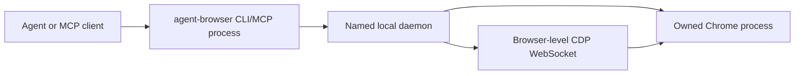
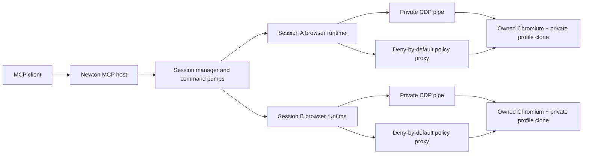

# No-extension architecture research and compact Newton proposal

> Historical proposal and decision record. The owned-browser recommendation has been
> implemented and the former extension/relay/store architecture has been deleted. Use
> `README.md`, `INSTALL.md`, and `PROGRESS_LEDGER.md` for current operation and status.

- Date: 2026-08-09
- Newton Browser version: `0.4.5`
- Newton working revision: `88e6bf57e1949e4e66749810ea5538bf55a9c49d` plus the current integration worktree
- agent-browser version: `0.33.2`
- agent-browser revision: [`acbc22bdc5d4f6c5a88d97d4a4745d3c5eb0591f`](https://github.com/vercel-labs/agent-browser/tree/acbc22bdc5d4f6c5a88d97d4a4745d3c5eb0591f)

This document preserves the source-code audit and the proposal that preceded the approved
migration. The owner subsequently authorized extension removal and the narrow opaque-copy
identity design. It is historical rationale, not the current operating contract; current
requirements live in `AGENTS.md`, `README.md`, and `PROGRESS_LEDGER.md`.

## Decision summary

Removing Newton's MV3 extension is technically viable and is probably the better long-term architecture if Newton accepts two product changes:

1. Newton owns the Chromium process used by each session instead of attaching to an ordinary, already-running user tab.
2. Authenticated profile reuse becomes an explicit import/clone operation with a narrowly documented exception to the current prohibition on reading browser profile files.

The recommended architecture is:

> One TypeScript MCP host, one directly owned Chromium process per concurrent Newton session, one private CDP transport per process, one deny-by-default policy proxy per session, and one compact agent surface.

Newton should borrow agent-browser's browser ownership and compact accessibility rendering, but not its per-session daemon, unauthenticated local ports, broad profile copier, 152-tool MCP surface, generic `Done` results, or hostname-only containment.

Rust is not required. Newton can implement the architecture in its existing Node/TypeScript runtime. Direct browser ownership removes the extension parity problem; Rust would only change the implementation language.

## What agent-browser actually implements

The common description that agent-browser "notices Chromium and attaches to it" describes only optional attach modes. Its default path launches and owns Chrome.

| Mode | Actual implementation | Browser ownership | Profile behavior |
|---|---|---|---|
| Default | Starts a per-name daemon, lazily launches Chrome with `--remote-debugging-port=0`, reads `DevToolsActivePort`, and connects to the browser WebSocket | agent-browser owns and closes Chrome | New UUID temporary user-data directory |
| `--profile Default` | Resolves the system Chrome profile, recursively copies it, then launches Chrome against the copy | agent-browser owns and closes Chrome | Ephemeral broad clone of the selected user profile |
| `--profile ./path` | Launches Chrome directly against the provided directory | agent-browser owns and closes Chrome | Persistent automation-owned or caller-supplied directory |
| `--cdp` | Connects to a supplied DevTools endpoint | External process | No profile ownership |
| `--auto-connect` | Reads `DevToolsActivePort` from candidate user-data directories and then probes conventional debug ports | External process | Requires Chrome to have remote debugging enabled |

The default path is implemented in [`chrome.rs`](https://github.com/vercel-labs/agent-browser/blob/acbc22bdc5d4f6c5a88d97d4a4745d3c5eb0591f/cli/src/native/cdp/chrome.rs#L378-L690) and [`browser.rs`](https://github.com/vercel-labs/agent-browser/blob/acbc22bdc5d4f6c5a88d97d4a4745d3c5eb0591f/cli/src/native/browser.rs#L414-L620). The daemon/session lifecycle is in [`connection.rs`](https://github.com/vercel-labs/agent-browser/blob/acbc22bdc5d4f6c5a88d97d4a4745d3c5eb0591f/cli/src/connection.rs#L783-L884) and [`daemon.rs`](https://github.com/vercel-labs/agent-browser/blob/acbc22bdc5d4f6c5a88d97d4a4745d3c5eb0591f/cli/src/native/daemon.rs#L23-L159).

The resulting topology is:



Every distinct named session normally gets a distinct daemon, Chrome process, and profile. Complete commands in the same daemon are serialized under one state mutex; different named sessions run concurrently.

### The daemon is not the useful part for Newton

agent-browser needs its daemon because ordinary CLI commands are short-lived processes. Its MCP implementation preserves CLI parity by spawning the current executable for each tool call, which then talks to the daemon. See [`mcp.rs`](https://github.com/vercel-labs/agent-browser/blob/acbc22bdc5d4f6c5a88d97d4a4745d3c5eb0591f/cli/src/mcp.rs#L3574-L3647).

The proposed Newton runtime already had one MCP host capable of owning browser processes directly. Adding another daemon would have duplicated ownership, IPC, versioning, cleanup, and recovery. The implemented product therefore uses direct stdio only and has no continuity daemon or socket.

### Local transport qualifications

agent-browser uses:

- a Unix socket per daemon on Unix;
- unauthenticated loopback TCP for daemon IPC on Windows;
- an ephemeral loopback DevTools port for Chrome;
- an additional loopback preview server.

These are local boundaries, not private capabilities. Newton should prefer an inherited `--remote-debugging-pipe` so no discoverable CDP listener exists. If Chrome/Edge pipe support proves unreliable on a required platform, the fallback must be an explicitly loopback-bound random port with a private user-data directory, endpoint ownership checks, no persisted public URL, and a same-user threat statement.

Chrome 136 and later ignore remote-debugging switches against the default user-data directory. Chrome explicitly requires a non-standard `--user-data-dir`, which fits an imported copy or Newton-owned profile but rules out silently attaching to an ordinary default profile through launch flags. See [Chrome's remote debugging security change](https://developer.chrome.com/blog/remote-debugging-port).

## What profile reuse really does

For a named profile such as `Default` or `Work`, agent-browser:

1. searches platform-default Chrome, Chromium, Canary, and Brave user-data roots;
2. reads and parses `Local State` to enumerate `profile.info_cache`;
3. resolves the selected display or directory name;
4. creates `agent-browser-profile-<UUID>` under the OS temp directory;
5. copies `Local State` and recursively copies the selected profile;
6. launches the copy with the real OS keychain; and
7. best-effort deletes the copy after Chrome exits.

The implementation is in [`chrome.rs` profile discovery](https://github.com/vercel-labs/agent-browser/blob/acbc22bdc5d4f6c5a88d97d4a4745d3c5eb0591f/cli/src/native/cdp/chrome.rs#L1030-L1199) and [`copy_chrome_profile`](https://github.com/vercel-labs/agent-browser/blob/acbc22bdc5d4f6c5a88d97d4a4745d3c5eb0591f/cli/src/native/cdp/chrome.rs#L1209-L1326).

Only these directories are excluded:

- `Cache`
- `Code Cache`
- `GPUCache`
- `Service Worker`
- `blob_storage`
- `File System`
- `GCM Store`
- `optimization_guide`
- `ShaderCache`
- `component_crx_cache`

Everything else is eligible for copying. Tests explicitly copy `Cookies` and `Local Storage`. Unexcluded data can include History, Login Data, Web Data, IndexedDB, Session Storage, extensions, preferences, and other profile material.

### Limitations Newton should not copy

- There is no coherent snapshot or source lock.
- Inaccessible files are warned about and skipped instead of failing the import.
- A live SQLite or LevelDB copy can be incomplete or inconsistent.
- There is no post-copy authentication or completeness check.
- Cleanup is best effort and lacks a realpath-bound owner marker or filesystem identity check.
- Symlink traversal and path-replacement attacks are not covered by its tests.
- The copy is useful only for the same OS user and machine when the real keychain can decrypt the profile state.
- Named-profile mutations are discarded; they are not merged back into the source.

The implementation's own docs advise Windows users to close Chrome, but the code does not enforce that condition.

### Agent-browser does not combine profile reuse with its allowlist

This is the most important security finding. agent-browser explicitly rejects `--allowed-domains` when used with `--profile`, `--cdp`, `--auto-connect`, restored state, or direct-page providers. Its rationale is that restored pages or existing scripts may run before containment is installed and popup/worker containment needs browser-level target attachment. See [`ensure_allowed_domains_supported_for_launch`](https://github.com/vercel-labs/agent-browser/blob/acbc22bdc5d4f6c5a88d97d4a4745d3c5eb0591f/cli/src/native/actions.rs#L2711-L2801).

That is an honest limitation. Newton must not claim strict origin containment merely because it launches a copied profile and installs CDP Fetch rules after startup.

## Newton's recommended authenticated-profile model

The compact design should support two modes.

### Mode A: Newton-owned persistent identity

This is the safest default.

- Newton creates a private named user-data directory.
- The operator signs in once in a visible Newton-owned browser.
- Chrome alone reads and writes its cookies, storage, and credentials.
- Newton never enumerates or parses the profile contents.
- The identity is locked to one running browser process at a time.
- Concurrent sessions receive ephemeral clones of the Newton-owned identity or are explicitly serialized until safe clone semantics are implemented.

This mode can preserve the current prohibition on inspecting user profile files.

### Mode B: explicit opaque import from an existing Chrome or Edge profile

This matches the user's desired zero-setup authentication, but it requires a product-boundary amendment.

The import should be a CLI/operator operation, not an MCP tool exposed to agents:

```text
newton-browser profile list --browser chrome
newton-browser profile import --browser chrome --profile "Default" --name work
newton-browser profile refresh work
newton-browser profile remove work
```

Required behavior:

1. Require explicit operator selection and consent.
2. Require the source browser/profile to be closed; fail on a live lock or any unreadable required file.
3. Resolve and realpath the exact platform profile root.
4. Create an owner-only staging directory with a random ownership marker and bound filesystem identity.
5. Copy a documented auth-oriented allowlist as opaque bytes. Never parse, log, return, index, or expose the contents.
6. Exclude saved passwords, autofill, history, downloads, extensions, tab/session restore, service workers, caches, and crash data.
7. Copy database sidecars consistently and reject any source metadata change during the import.
8. Validate the staged structure without opening cookie/storage databases.
9. Atomically publish a Newton-owned identity seed.
10. Launch each concurrent session from a private copy-on-write or full clone of that seed; never let Chrome write to the source profile or seed.
11. Record only bounded metadata: identity name, browser family, source profile display name, import time, bytes, format version, and health category.
12. Use identity-bound cleanup with exact realpath, device/inode or Windows file identity, owner marker, and direct-child constraints.

An auth-oriented copy still contains tokens from multiple origins because Chrome's cookie and storage databases are shared. Newton's typed MCP and origin boundary must make that data unreachable to agents. This is not equivalent to origin-scoped credential extraction.

### Required product-boundary amendment

The current rule says Newton must never inspect browser profile files. A safe explicit exception would be:

> Newton must not inspect, parse, log, return, modify, or export cookies, browser storage, saved passwords, credentials, or browser-profile contents. With explicit operator authorization for a named local profile, Newton may enumerate bounded profile metadata and byte-copy a documented allowlist of files as opaque data into a Newton-owned identity. The source must be closed and unchanged; any lock, unreadable required file, symlink, path escape, or consistency failure aborts and removes the staging copy. Password, autofill, history, download, extension, restored-tab, service-worker, and cache data must not be copied. Imported identities are same-user, same-machine, non-exportable, owner-only, and never synchronized back to the source.

This amendment must be approved before implementation. It should not be smuggled into an ordinary code change.

## Compact no-extension Newton architecture



### Why one browser process per session

- A browser-global target watcher becomes session-local by construction.
- A policy proxy can enforce exactly one session's grants.
- Cookies, storage, targets, workers, downloads, and crashes cannot cross sessions.
- Existing Newton cross-session concurrency remains natural.
- Same-session FIFO and idempotency stay in the existing command pump.
- Teardown can kill one exact process tree without touching other agents.

The cost is memory. Chromium processes dominate that cost, not Node or Rust. Before locking the default concurrency cap, benchmark 1, 2, 4, and 8 headed processes on Windows Chrome, Windows Edge, and Linux Chrome.

### Do not add a second daemon

The existing MCP host should own all browser runtimes directly:

```text
MCP stdio or explicit continuity socket
  -> existing host session ledger
  -> existing per-session command pump
  -> in-process BrowserRuntime
  -> private CDP transport
  -> owned browser process
```

This collapses MCP, CLI, and browser behavior onto one implementation. The CLI should remain an operator/configuration wrapper around the same runtime, not a second action grammar.

### Direct CDP transport

The current driver has only a small number of direct extension API edges:

- `chrome.debugger.attach/detach/sendCommand`
- `chrome.scripting.insertCSS/executeScript`
- `chrome.tabs.sendMessage` for the overlay

Most target registry, containment, actionability, input, dialog, renderer, observation, and verification logic is already transport-agnostic.

Introduce an injected port:

```ts
export interface BrowserCdpTransport {
  attach(): Promise<void>;
  detach(): Promise<void>;
  send(
    method: string,
    params?: Record<string, unknown>,
    route?: { sessionId?: string | null; timeoutMs?: number },
  ): Promise<Record<string, unknown>>;
  onEvent(listener: (event: {
    method: string;
    params: Record<string, unknown>;
    sessionId?: string | null;
  }) => void): () => void;
  onDisconnect(listener: (reason: string) => void): () => void;
}
```

Overlay injection should move to `Page.addScriptToEvaluateOnNewDocument`/`Runtime.evaluate`, or be removed from the acceptance-critical path. It must not justify retaining an extension.

### Browser lifecycle

For every session:

1. Validate normalized exact HTTP(S) origins and profile identity selection.
2. Reserve session, process, profile, port/pipe, and output limits.
3. Start the deny-by-default policy proxy.
4. Materialize the private session profile.
5. Launch Chrome/Edge with a blank first page, disabled session restore, disabled QUIC/direct WebRTC bypass, and no unrelated extensions.
6. Connect through the private CDP pipe.
7. Install browser-level paused target attachment and Fetch/script controls before navigation.
8. Create or claim exactly one blank root target.
9. Navigate to the granted initial origin through the policy boundary.
10. Verify committed origin and containment readiness.
11. Publish the session to the MCP host.

Shutdown is the reverse transaction. It must close controlled targets, drain/fence CDP, request `Browser.close`, wait on process exit, kill the exact process tree if necessary, close the proxy, and remove only the identity-bound session clone. On Windows use a Job Object or equivalent tree ownership; on Unix use a dedicated process group.

### Strict origin containment still requires a network boundary

Browser-level Target/Fetch auto-attachment is valuable but cannot prove that no disallowed first request escapes every popup/startup race. The primary enforcement should be a session-local, deny-by-default policy proxy active before Chromium starts.

The proxy must:

- allow only exact normalized scheme/host/port grants;
- cover HTTP, HTTPS CONNECT, WebSocket, EventSource, redirects, frames, workers, popups, downloads, and service-worker traffic;
- disable direct fallback, QUIC, and non-proxied WebRTC transports;
- emit only bounded method/origin/category/count evidence;
- never store request or response bodies;
- support one immutable grant set per browser process;
- fail the session closed if the proxy exits or its policy becomes unavailable.

CDP Fetch and target controls remain defense in depth and provide action attribution. The proxy provides the process-wide first-request boundary.

## Token-efficiency findings

Removing the extension does not itself reduce model tokens. Token cost comes from tool schemas, instructions, observations, action results, and repair calls.

I measured the installed `agent-browser@0.33.2` MCP dynamically with `o200k_base`, using the same tokenizer family as Newton's release gate. The payload is compact JSON containing server instructions and all discovered tool schemas.

| MCP surface | Tools | Tokens | Relative to Newton |
|---|---:|---:|---:|
| Newton current complete catalog | 11 | 2,818 | 1.0x |
| agent-browser default `core` | 29 | 11,545 | 4.1x |
| agent-browser `all` | 152 | 58,101 | 20.6x |

agent-browser's own deterministic context eval uses `ceil(characters / 4)`, not a tokenizer. Its actual CLI skill context measured:

| CLI context | `o200k_base` tokens |
|---|---:|
| Thin installed discovery skill | 701 |
| `skills list` output | 126 |
| Dynamic core guide | 6,280 |
| Thin + list + core | 7,107 |
| Thin + list + full guide | 27,402 |

The thin discovery stub is a good progressive-disclosure idea. The large MCP is not.

### Why agent-browser's MCP is expensive

- 29 default tools and 152 full tools.
- Repeated global session/config properties on individual tool schemas.
- Tool profiles reduce the exposed subset but still leave the default much larger than Newton.
- Pagination bounds one `tools/list` response, not the total context if the client follows every cursor.
- The MCP layer manually translates typed tools back into CLI arguments and spawns a child executable per call.
- `extraArgs` reintroduces a generic escape hatch despite the typed surface.

### What Newton should borrow for agents

1. Compact one-node-per-line accessibility rendering.
2. Interactive-only, role, query, depth, and max-node refinement.
3. Checked, selected, expanded, disabled, required, and value states.
4. A thin skill that teaches the ordinary observe-act-verify loop and loads detailed references only when needed.
5. Exact token budgets for catalog, observation, action result, and verified workflow.
6. Optional batch/flow execution for deterministic multi-step forms, with stop-on-first-uncertain behavior.

### What the proposal recommended retaining

- A small catalog; the implemented modern-only surface contains ten tools.
- One discriminated `browser.act` surface rather than dozens of tools.
- Document/frame-qualified refs and explicit stale/ambiguous outcomes.
- Compact JSON/text observations with hard node/character caps.
- Verified action outcomes, retry safety, changed facts, and bounded deltas.
- Default untrusted-page-content provenance.
- No generic JavaScript evaluation, raw CDP, cookie, storage, or credential tools.

### What not to copy

- Four-token `Done` results as the only mutation evidence.
- Role/name/ordinal stale-ref healing that may retarget a different element.
- DOM mutation to discover cursor-interactive nodes.
- Unbounded snapshots or stderr in tool results.
- A full CLI-parity MCP surface.
- A second command grammar maintained separately from MCP.
- A tokenizer or model dependency in production; token counting remains a development/release gate.

## Rust assessment

Rust gives agent-browser a smaller native daemon, lower idle RSS, and a self-contained binary. It does not create its token advantage and does not remove Chrome/CDP latency.

For Newton:

- the existing Node host is already required and small compared with one or more Chromium processes;
- `ws` is already a dependency and can implement browser WebSocket CDP if the pipe spike fails;
- TypeScript can reuse the current driver and safety types;
- avoiding a Rust rewrite keeps one language across host, driver, schemas, tests, and release tooling;
- eliminating the extension removes the browser-side JavaScript parity boundary that previously weakened the case for a host-only rewrite.

The correct order is: remove the extension architecture, measure the resulting host/process costs, and consider a native supervisor only if evidence later shows Node is a material bottleneck.

## Reuse, replace, and delete map

### Reuse with targeted refactoring

- `packages/core/src/*`: action schema, policy, provenance, redaction, risk, outcomes.
- `packages/driver/src/driver.ts`: target handling, containment attribution, observations, actionability, input, dialogs, renderer liveness.
- `packages/driver/src/target-registry.ts`: target/frame/session identity and refs.
- `packages/driver/src/session-command-pump.ts`: same-session FIFO, idempotency, bounds, timeout phase.
- `packages/driver/src/session-transaction.ts`: rollback and finalization patterns.
- `packages/driver/src/origin-containment.ts`: policy decisions and defense-in-depth CDP handling.
- `packages/driver/src/controller.ts`: session orchestration after replacing tab/extension ports.
- `apps/mcp-server/src/mcp-server.ts`, `mcp-contract.ts`, `agent-output.ts`: public compact surface.
- Existing deterministic fixture/eval and token-budget infrastructure.

### Add

- `apps/mcp-server/src/browser-runtime/browser-discovery.ts`
- `apps/mcp-server/src/browser-runtime/chromium-process.ts`
- `apps/mcp-server/src/browser-runtime/process-supervisor.ts`
- `apps/mcp-server/src/browser-runtime/cdp-pipe.ts`
- `apps/mcp-server/src/browser-runtime/cdp-websocket.ts` only if needed as fallback
- `apps/mcp-server/src/browser-runtime/policy-proxy.ts`
- `apps/mcp-server/src/browser-runtime/profile-store.ts`
- `apps/mcp-server/src/browser-runtime/session-runtime.ts`
- Focused tests beside each runtime module and new real-browser acceptance scripts.

### Replace or collapse

- Replace direct `chrome.*` calls in `packages/driver/src/driver.ts` with injected ports.
- Replace `packages/driver/src/chrome-tabs-port.ts` with CDP target creation/closing.
- Collapse extension subscription/ownership routing in `apps/mcp-server/src/bridge.ts` into in-process runtime dispatch while retaining queues, results, and continuity semantics.
- Make `apps/mcp-server/src/cli.ts` call the same runtime/config/profile modules used by MCP.
- Replace extension readiness with browser-runtime readiness.

### Delete only after migration gates pass

- `apps/extension/**`
- `scripts/build-extension.mjs`
- `scripts/build-extension-artifact.mjs`
- extension store documentation and artifacts
- extension-specific onboarding, panel, icons, transport, and worker-restart tests
- extension-origin WebSocket relay paths that no longer serve the optional continuity mode

Do not delete these in the first implementation change. Keep a temporary backend flag until direct CDP passes deterministic, packed, Windows Chrome/Edge, and Linux Chrome acceptance.

## Proposed implementation sequence

### Phase 0: approve the boundary and run feasibility spikes

- Approve extension removal as the target architecture.
- Approve Mode A only or Mode A plus the opaque import amendment.
- Prove Chrome and Edge direct CDP pipe framing on Windows and Chrome on Linux.
- Prove one process per session with two and four simultaneous sessions.
- Prove same-user copied-profile authentication in a disposable test profile without exposing cookie values.
- Prove policy-proxy zero-request containment before any profile-backed page can run.

Exit: no implementation plan relies on an unproved pipe, profile, or containment assumption.

### Phase 1: injected CDP and owned ephemeral browsers

- Introduce the transport interface.
- Move the current driver off global `chrome.*` APIs.
- Add process supervision and blank-first browser startup.
- Keep the public MCP contract unchanged.
- Run the current driver/registry/input suites against a fake direct-CDP transport.

Exit: ephemeral no-extension sessions pass startup, observation, action, OOPIF, dialog, crash, and cleanup tests.

### Phase 2: strict policy proxy and browser-level target control

- Start the proxy before the browser.
- Make loss of proxy authority terminal for the session.
- Install browser-global paused target controls before first navigation.
- Port the full popup/frame/worker/redirect/WebSocket/EventSource matrix.

Exit: destination application counters remain zero for every ungranted first-request path.

### Phase 3: profile store and explicit import

- Implement Newton-owned identities first.
- Implement opaque existing-profile import only after the policy amendment.
- Add closed-source enforcement, consistency checks, atomic staging, exact cleanup, and same-machine keychain diagnostics.
- Add per-session clone isolation and concurrency caps.

Exit: authenticated sessions work without source mutation, leaked files, credential exposure, or cross-session state.

### Phase 4: collapse host/extension routing

- Dispatch MCP session commands directly to in-process runtimes.
- Preserve continuity, command ledger, outcome classification, finalization, and multi-client behavior.
- Remove extension reload/store/update concepts from setup and doctor.
- Retain a temporary extension fallback only until parity evidence is complete.

Exit: the no-extension backend is the default and all normal workflows use one implementation path.

### Phase 5: compact rendering and final removal

- Make compact observation the ordinary agent view.
- Keep raw JSON and verbose evidence explicit.
- Rerun exact catalog/workflow budgets and identical cross-product agent tasks.
- Delete the extension, build/store scripts, relay branches, and stale plans/docs.
- Run `pnpm release:check` three consecutive times from the exact final tree and execute the live Windows/Edge/Linux matrix.

Exit: no extension artifact, reload, store update, or extension parity test remains in the product.

## Acceptance conditions

- [x] Ordinary startup requires no installed browser extension.
- [x] The MCP host owns every default browser process and exact process tree.
- [x] No public or discoverable CDP endpoint exists in the preferred pipe mode.
- [x] Same-session commands remain FIFO and cross-session commands progress concurrently.
- [x] Browser-global target controls cannot see another Newton session's browser.
- [x] Ungranted application requests are prevented before send across navigation, popup, redirect, frame, worker, WebSocket, EventSource, download, and supported WebRTC paths in the implemented direct architecture.
- [x] Profile-backed startup cannot run restored pages outside the proxy boundary.
- [x] Imported profile source files are never modified.
- [x] Partial/locked/inconsistent imports fail closed and leave no staged clone.
- [x] Password, autofill, history, extension, restored-tab, service-worker, download, and cache data are excluded by the implemented opaque-import allowlist; authorized Chrome Default import and cleanup passed. Authentication preservation is explicitly optional and not claimed, including for Windows App-Bound encrypted standard-profile data.
- [x] No cookie, storage, credential, profile content, CDP identifier, or raw browser error reaches an agent result or diagnostic receipt.
- [x] Chrome/Edge crashes and post-input transport loss return uncertainty without automatic mutation replay.
- [x] Windows Job Object and Unix process-group tests prove no owned browser descendants remain.
- [x] The compact catalog remains at or below its token budget; the implemented modern-only surface contains ten tools.
- [x] Compact observations and verified workflows remain within release budgets.
- [x] Windows Chrome, Windows Edge, and Linux Chrome live matrices pass from packed artifacts.
- [ ] The exact final evidence-bearing tree passes the complete release gate three consecutive times. An earlier snapshot passed 3/3; the owner-approved unauthenticated QA scope and documentation/evidence changes require one final frozen rerun.

## Final recommendation

Proceed toward a no-extension Newton, but use a Newton-native design:

1. Keep TypeScript and the compact MCP.
2. Make the MCP host the only runtime owner.
3. Use one private owned browser process per concurrent session.
4. Use a launch-time deny-by-default proxy plus browser-level CDP controls.
5. Offer Newton-owned identities by default.
6. Add explicit opaque Chrome/Edge profile import only after approving the narrow policy exception.
7. Preserve verified outcomes, stable refs, multi-agent concurrency, and hard output caps.
8. Delete the extension only after direct-CDP live parity, not at the beginning of the migration.

This removes the recurring MCP/CLI/extension parity and Chrome Web Store burden without trading away the ideas that distinguish Newton from agent-browser.
