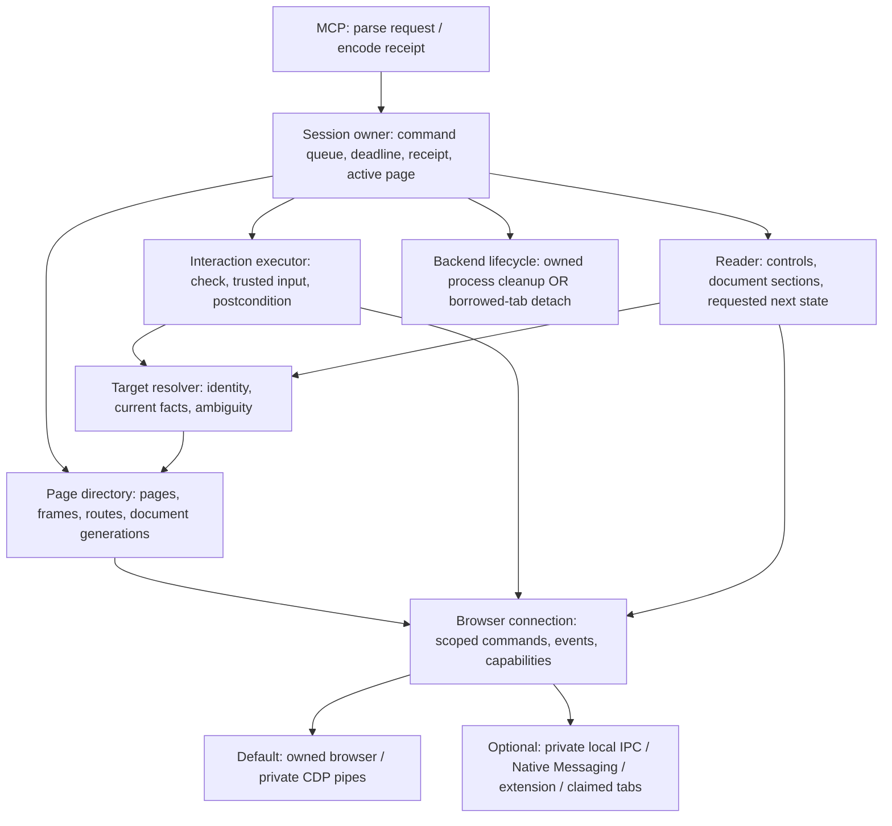

# Proposed session engine and model interaction architecture

Status: proposal, 2026-09-07. This is the replacement design requested after the
[adversarial audit](ADVERSARIAL_AUDIT_2026-09-07.md), grounded in production source
`f2ae1ee` / 0.6.4. It is not an implemented feature list or a release claim.

Execution detail: [granular implementation guide](IMPLEMENTATION_GUIDE.md), including
the foundations recommended for implementation here before Spark work, ordered packets,
executable teaching examples, and exact verification requirements. Its wire-contract
details refine the illustrative examples in this document; no new runtime is implemented
merely by writing that guide.

The [Chrome-control comparison](CHROME_CONTROL_LESSONS.md) provides the evidence behind
the reader, composition and editing requirements integrated below. The later operator
request also proposes optional access to an existing Chrome profile through a thin
extension; section 10 specifies that addition, its costs and its update workflow.
This revises the proposal's earlier extension non-goal. The installed implementation
at the original audit baseline was standalone-only. The current candidate now contains
optional adapter assets, explicit Windows Chrome setup, native discovery and shared-engine
existing-tab control, verified from packed artifacts in disposable browsers. Durable
public update/recovery now passes packed Windows Chrome transaction/recovery QA;
cross-platform work and the remaining acceptance gates are unfinished. This is not a
claim that the complete replacement has shipped. See
[the execution checkpoint](implementation/ASTRA_EXECUTION.md) for current code and evidence.

The operator resolved the remaining product choices on 2026-09-07: default to a shared
Newton login source with one headless browser and writable identity per worker; select
the existing browser only on explicit request; allow parallel extension workers on
different owned tabs; add no Newton permission prompts. The first replacement release
means the completed design and bug fixes with real online task QA, not a partial slice.

Current candidate checkpoint (2026-09-08): the private client is shared by live
existing-browser discovery, tab claims and development update QA. Discover/setup
perform a real handshake and bounded current-tab inventory; configured paths alone
do not mean ready. Required tab capabilities are checked before use. The broker
advertises atomically after hello and bounds requests until responses arrive.
Malformed native replies cannot become successful command acknowledgements.
These source changes and packed adapter tests do not complete production setup:
public installation/update/recovery, installed build expectations, multi-instance
discovery and correct browser identity across reload remain unfinished. The
development reload verifier uses a unique disposable host namespace; do not copy
that assumption into a shared installation. See the current
[execution checkpoint](implementation/ASTRA_EXECUTION.md) for exact artifact evidence.

Update continuity refinement (2026-09-08, 08:57 UTC): the candidate now proves an
extension-scoped random ticket in a temporary inactive blank tab across reload.
Two live profiles sharing the same extension/native installation were exercised;
only the selected profile could prove the marker. A shared native reconnect module
watches advertisements and validates that proof before returning a peer. The old
single-profile namespace assumption is removed from update QA. Extension-owned
pages were experimentally rejected as markers because Chrome removes them on reload.
The temporary blank marker contains no script, browser storage or website data and
is removed after verification. A normal authorized tab supplies the fresh claim/DOM
smoke because Chrome rejected debugger attachment to the internal blank marker.
Durable interrupted-update recovery and public installation commands remain open.
This is a local development-update mechanism, not a browser-store distribution claim.

## Decision

Rebuild the execution and observation core around a session owner. Retain the local
process-ownership foundation and low-level components that survive contract tests.
This is a substantial internal replacement, not ten unrelated bug patches and not a
rewrite of every working subsystem.

The product's unit of value is **a completed interaction with enough trustworthy state
for the model's next decision**. A CDP acknowledgement is too small a unit; an autonomous
browser workflow engine is too large. Newton executes the caller's bounded intent and
returns evidence. It does not infer goals, authorize effects, or run a model inside the
browser product.

Optimize total task cost: model decisions, tool turns, waiting, repair, tokens and human
intervention. Optimizing only per-call duration or response size can make that cost worse.
Correctness and effect uncertainty are hard constraints, not terms to trade away for speed.

## What changes, and what stays

| Area | Decision |
| --- | --- |
| Chromium ownership | Default: shared Newton login source, separate headless browser/writable identity per worker, private pipes, blank-first launch, guardian and exact cleanup. Optional: explicitly selected existing Chrome with parallel tab-scoped control and detach-only cleanup |
| Runtime organization | Replace overlapping host/runtime/driver orchestration with one session owner and a small set of cohesive collaborators |
| Model interaction | Action results include relevant next state; starting a session accepts the actual destination URL and returns initial state |
| Observation | Separate verification, relationship-preserving control views, structured records, document reading and screenshots; return explicit baselines and deltas |
| Target identity | Public references identify a live element within a page/frame/document; a read does not implicitly destroy other usable references |
| Waiting | Wait for the requested condition within one command deadline; remove unconditional global network settling |
| Result semantics | One typed receipt carries execution facts, postcondition evidence and observation availability independently |
| Batches | One exclusive queued operation with per-step results and explicit partial effects; never claim rollback |
| Diagnostics | Small local stage counters and exact error categories; no external telemetry or page-content recording |
| Public tooling | Improve the ordinary start/observe/act loop first; tool-count reduction is not a success metric |
| Distribution | Standalone package remains sufficient. Optional extension adds local Native Messaging registration and an on-demand transport helper; no installed daemon, hosted service or other product dependency |

The standalone process topology does not need to change for the core improvements.
Existing-profile access adds the optional topology described in section 10; it is not
a prerequisite for any standalone operation.
Do not put every session in another Node process merely to compensate for synchronous
code. First remove synchronous subprocesses and bound CPU work. If measured image work
still blocks other sessions, isolate that computation behind a bounded worker rather than
multiplying the whole control stack.

## 1. One authority for a session



These are ownership boundaries, not instructions to create seven frameworks or seven
packages. Keep the existing package boundaries unless a concrete dependency problem
requires moving them.

The session owner controls admission, execution order, cancellation, command records and
lifecycle. Only it constructs the canonical command receipt. The transport boundary
validates external input once and never derives a different action outcome. The executor
returns structured facts; it does not return a loosely shaped object that several callers
reinterpret.

The page directory alone maps browser target/session/frame identifiers and document
generations. The target resolver consumes that mapping. No second synthetic root-session
namespace, hidden active-page switch or independently reset ref index should be necessary
in ordinary execution. Remove an adapter only after its route-validation, attachment and
failure obligations have moved to the appropriate owner.

The reader obtains evidence. It does not alter the action's dispatch record. The process
supervisor owns shutdown escalation; driver detach cannot be a prerequisite for terminating
an unresponsive owned browser.

### What the command context contains

- Session, command and page identity; accepted action and output request.
- One monotonic execution deadline, cancellation signal and bounded work budget.
- Current stage, whether any browser input was attempted/acknowledged, and step progress.
- Resolved target binding: connection/claim generation, page, frame, document generation
  and backend node.
- Canonical terminal receipt, or a small current-state record while execution is active.

It should not contain a duplicate page tree, profile data, arbitrary caller functions,
an event-sourced history, or mutable copies of every public envelope.

One mutation/batch executes at a time per session. All reads that claim a coherent
after-action view queue behind it. Cheap session/command diagnostics and stop/cancel are
served outside that queue. Different sessions progress independently. CDP responses must
not wait behind an asynchronous lifecycle handler that is itself awaiting a CDP response.

The same session engine serves both connection types. Backend differences stop at
capability, routing and lifecycle operations; they do not produce another reader, target
resolver, action executor or outcome system. Borrowed-tab control additionally requires
exclusive claims across MCP processes, defined in section 10.

## 2. Design the model's normal loop first

Today a worker must frequently observe, act, observe again, repair references and decide
what the previous status actually meant. Replace that with:

1. Start at the actual URL and receive a usable initial view.
2. Act on a reference or a precise target and receive the relevant resulting view.
3. Continue; explicitly request a broader read or screenshot only when needed.
4. Stop when the task is complete.

The initial URL is normalized once. The shared source is selected by explicit/default
Newton configuration, not per-origin grants or a personal-profile heuristic. Its origin
is not a network permission. Normal redirects and cross-origin behavior remain untouched.
Browser ownership can be ready while a page is still loading. Report those facts separately
instead of requiring a preliminary status call or pretending the whole site is ready.

For an existing-tab claim, select the tab from fresh authorized metadata and observe it
in place. Do not navigate/reload it merely to satisfy the initial-URL shape used for new
pages. Reconcile changed URL/title or recycled tab identity before taking control.

### Proposed request and response shape

The exact wire names below are illustrative, not an extra compatibility API to implement.
Freeze them with the first implementation slice and update the existing catalog and skill
together.

```json
{
  "sessionId": "s1",
  "commandId": "c17",
  "action": { "kind": "click", "ref": "p1:d4:e23" },
  "expect": { "kind": "visible", "role": "dialog", "name": "Edit item" },
  "observe": { "scope": "dialog", "maxBytes": 8192 }
}
```

```json
{
  "commandId": "c17",
  "state": "completed",
  "dispatch": "acknowledged",
  "postcondition": { "state": "met", "kind": "visible" },
  "page": { "id": "p1", "document": 4, "url": "https://example.com/items" },
  "observation": {
    "snapshot": 12,
    "scope": "dialog",
    "complete": true,
    "nodes": [
      { "ref": "p1:d4:e31", "role": "textbox", "name": "Title" },
      { "ref": "p1:d4:e32", "role": "button", "name": "Save" }
    ]
  }
}
```

Real output includes the established untrusted-page-data boundary and appropriate
redaction. The example omits that wrapper for readability. It must never promote page
text into a host-authored recommendation to send, save, retry or authorize anything.

Separate three facts:

| Fact | Meaning |
| --- | --- |
| Dispatch | Whether browser input was not started, attempted with uncertain acknowledgement, or acknowledged |
| Postcondition | Whether the requested/local condition is met, not met, unknown, or not requested |
| Observation | Whether a requested view was returned, incomplete, or unavailable |

A failed optional read must not turn an acknowledged input into prevention. A matching
field value does not prove the server saved it. A completed command may have a failed
postcondition. Do not offer a universal business-success boolean.

Count focus, scroll, key-down and other preparatory input in dispatch accounting: they
can trigger application handlers. Blocking text entry after focus is not proof that
nothing happened. Input cleanup such as releasing a held button is recorded as cleanup,
not a second user action or an invitation to retry.

Keep ordinary receipts compact. Diagnostics such as per-phase CDP counts belong in
explicit diagnostic output and test receipts, not every model response.

### Useful defaults without hidden intent inference

An omitted observation request uses a documented, bounded default:

- Fill/select: target value/state and relevant validation context, with sensitive values
  omitted; no whole-page tree.
- Click/key: page identity, dialog/navigation/popup changes already observed, and a small
  controls view when the interaction changes context.
- Navigate/start: initial controls and readable location/title once document evidence exists;
  report incomplete/loading when appropriate.
- Explicit wait: the matched evidence, not an unrelated page dump.

An explicit scope can request a dialog, container/ref, matching controls, a document section
or no extra discovery. The reader obeys the request; it does not guess the user's business
goal. If the requested scope cannot be found, say that without pretending an empty result
means the page contains nothing.

### Composition and representation selection are part of the contract

Return state automatically with initial session/page selection. Let the client compose
already-decided typed actions and the resulting read in one invocation; put an exclusive
sequence inside the session queue when interleaving would be incorrect. Keep tab/session
handles reusable in an optional small client helper. The calling harness may filter or
aggregate returned records locally; Newton gains no separate code-execution service.

The default worker guidance is short: use controls for interaction, structured records
for data, document sections for reading, and screenshots for visual uncertainty. Request
both image and text only when the decision needs both. Do not repeat an unchanged read
without an intervening action or a named condition that justifies waiting. A response
must state its scope and completeness so that small output is not mistaken for all data.

## 3. A bounded page directory, not a cached replica of the website

Keep only what action execution needs: owned or explicitly claimed pages, opener relationships, live frames,
CDP routes, document generations, retained public refs and bounded read snapshots.

Document identity and observation sequence are different. A new observation increments a
snapshot sequence; it does not create a new document. A same-document route change updates
URL/provenance, while a new document invalidates old element bindings even if its URL is
identical. A replaced element is not the old element simply because its label matches.

Public refs are opaque to the model. Internally they bind to a page/frame/document/node.
Use monotonically allocated identities within the session so an expired token cannot
later identify a different element. Private verification reads do not allocate or reset
public refs.

Refs remain usable while their target is live and retained. Give retention a bounded,
documented window. Eviction happens when publishing a new view, with explicit expiry
metadata for the affected public snapshots. It never happens as an undocumented side
effect of a fill. A ref that is gone produces a precise pre-input stale result; do not
silently reinterpret it as a text selector and click a replacement.

Long-lived refs are not a demonstrated special property of the comparison interface;
its guidance uses fresh AX indices. The hard requirement is current actionable evidence
without hidden invalidation. Explicitly superseding a public snapshot while returning
its replacement is acceptable. Benchmark that simpler policy before adding complex
retention machinery.

Full discovery is not a prerequisite for a ref action. Revalidate that one binding and
its current actionability/floor facts. Semantic target lookup filters candidates before
output limits, rejects ambiguity, and measures only candidates needed for the action.
If its search work limit is reached, report search incomplete rather than not found.

CDP events update topology and provide invalidation hints. They are not a guarantee that
every application attribute/layout mutation has been observed. Freshness needed for input
is checked at use. Geometry is normally command-scoped; never infer an unchanged box solely
from an unchanged role/name/value or scroll position.

Hidden-tab input also requires real compositor readiness. The shared executor enables
Chromium's overlay domain solely for unbuffered debugger input; it never requests an
overlay or inspect mode. It observes a hidden document's viewport before its first pointer
action, and starts a viewport observation alongside hidden wheel dispatch to satisfy
Chromium's visual-state callback. It never activates tabs, emulates visibility, injects
page mutations or retries the input. Internal frame observations are single-flight per
page and their pixels are discarded. Verified input must not wait for an optional capture
whose completion is blocked by another tab's native modal. The headed/headless adapter
regression checks actual trusted input effects and zero visibility transitions.

Use command-scoped remote object groups where applicable, released on success, failure,
cancellation and navigation. Longer-lived node metadata needs an explicit size limit and
invalidation strategy. Do not introduce a second whole-page cache to rescue the first.

### Pages must be explicit

Add authorized page inventory and typed page selection to the session contract. Return new
page IDs and opener relationships in the action receipt. Selecting a controlled page updates
Newton's routing; it does not emulate focus or click browser chrome.

For a single popup caused by the active command, following it can be the documented default
and must be reported. For several candidates or an unrelated background popup, keep the
existing active page and return the candidates. Never make a queued action silently switch
to a different page. Bind commands to a page at admission; stop a batch if its page/document
assumption changes. Top-level pages and cross-origin frames are distinct identities.

## 4. Separate discovery, reading, visual control and verification

A single full observation is the wrong primitive for every job.

Control views retain enough hierarchy to associate duplicate buttons with their rows,
labels with inputs, errors with fields and controls with dialogs. Preserve headings,
table headers, selected/expanded/disabled state, focus and link destinations where relevant.
Compress decorative wrappers rather than flattening away useful relationships. Every
omission is governed by the requested scope and final budget.

| Operation | Minimum evidence strategy |
| --- | --- |
| Resolve existing ref | Validate one live binding; read current necessary target facts |
| Find role/name | Query/filter matching accessibility candidates before presentation limits |
| Discover controls | Bounded accessibility/DOM read with explicit scope and completeness |
| Read a document | Structured headings/paragraphs/links with truthful continuation |
| Extract records | Bounded table rows, links or form fields, preserving labels, cell boundaries and source scope |
| Verify fill/select | Read the intended target state and any requested validation condition |
| Verify navigation | CDP failure + document commit/location evidence; optional requested condition |
| Visual task | Screenshot/clip plus explicit coordinate action bound to its page and viewport |

Accessibility is the usual fast path, not the only interface. Canvas, charts, custom
controls and weak accessibility need a first-class screenshot/coordinate route. Reuse the
same executor, deadline, dispatch accounting and provenance for both routes. Coordinate
actions carry the page/document and screenshot viewport context; stale context is rejected
before input. A screenshot is evidence at capture time, not a guarantee the page has stopped
moving. No second visual agent, model-provider call or arbitrary page-JavaScript API belongs
inside Newton.

Retain trusted screenshot redaction. Do not freeze the page to make screenshot/coordinate
or masking guarantees appear stronger. Where masking cannot be trusted because the necessary
sensitive-zone evidence is unavailable, fail that capture explicitly.

The current candidate performs bounded native sensitive-field discovery automatically
across renderer roots and closed shadow trees; caller-supplied sensitiveZones are optional
additional masks. A completed scan with no regions intersecting the capture reports
mask_not_applicable, while incomplete or unstable geometry refuses the image. Real Chrome
pixel checks cover ordinary, closed-shadow, same-process and cross-process frame fields.
Standalone full-page capture now discards one unstable native capture and rebuilds all
evidence once under the original deadline; repeated instability refuses the image.
Packed adapter full-page capture now brackets hidden captures with a tiny native
screencast observation on the same debugger route, stopped after capture. Pending
cleanup prevents a replacement observation; failed release closes that connection.
Packed two-worker QA verifies full-page output with no tab visibility transitions. Transformed
and zoomed frame QA and same-process clipping remain acceptance work. These limitations
must not be hidden by weakening geometry checks or disabling normal rendering behavior.

### One output budget

Use one final serialized text-byte budget and explicit structural caps, applied after
redaction. The illustrative 8 KiB response above is a starting experiment, not a measured
optimum. Bound CDP read work separately so a tiny response cannot hide an unbounded scan.
Screenshot image bytes have their own existing size controls.

Reserve space for outcome, error, provenance and completeness before adding optional nodes.
Never truncate those fields to make content fit. Report incomplete whenever a work/output
limit prevented answering the requested scope.

Document continuation refers to a bounded, redacted snapshot of already-read page content,
with scope, cursor and expiry. This avoids silently skipping/repeating text as a live page
changes. If the snapshot expires, return that fact. Do not store browser history or profile
contents; this is only temporary current-page observation data. Preserve paragraph
structure. A diff refers to an explicit baseline; missing baseline returns a bounded fresh
view rather than applying a delta to unknown state.

Default control discovery should avoid serial geometry/fact calls for every candidate.
Filter cheap evidence first, collect only necessary metadata, and request geometry for
selected/action targets or explicit visual output. If viewport-only discovery needs
geometry, budget that work explicitly. Do not secretly redefine "visible" to mean merely
present in accessibility output.

Structured extraction is a first-class reader operation. Start with typed table/links/form/
document shapes rather than arbitrary page evaluation. Return actual current-page records
with source scope, missing values and completeness; preserve row and field relationships.
Virtualized content is only partially present in the DOM, so never call that subset the
whole dataset. Reads do not silently scroll, fetch other endpoints or inspect application
globals/storage. The client can then filter and aggregate returned records without a new
browser execution service or asking the model to manually reconstruct a table.

## 5. Execution that is bounded and honest

Each interaction follows one pipeline:

**admit → resolve → prepare → recheck → dispatch → verify → requested read → receipt**

The final target check belongs inside that pipeline and consumes the actual resolved
binding. Recheck after focus, frame/document change or necessary retargeting. Policy uses
the current target origin; source selection uses explicit/default Newton configuration.

There remains a race between a CDP facts read and later trusted input on an adversarial
page. Revalidation closes the reproduced focus-handler gap but cannot create an atomic
browser-level authorization primitive. Do not promise absolute sensitive-field prevention
against arbitrary concurrent page mutation under the no-instrumentation boundary. Input
values should never include secrets in the first place. Test and document the actual
boundary rather than claiming the last check makes all races impossible.

### Batches compress model turns

Typed editing also includes selecting a known text range, placing a cursor with explicit
prefix/suffix disambiguation, multiline insertion and exposed secondary control actions.
These use the same target/deadline/receipt pipeline. Add rich-content insertion only where
its input fidelity can be verified; do not implement it by secretly assigning DOM content
or reading the operator's clipboard. Resolve an unambiguous text match before input;
any later failure reports the actual preparatory/input effects rather than claiming none.

Support a bounded typed sequence as one queue entry, with an especially simple form-fill
shape. Resolve each next step when it is reached because earlier steps can change the DOM.
Retain exact checked bindings for each dispatch. Stop on ambiguity, policy rejection,
dialog, unexpected document/page change, deadline or uncertain effect.

Return the completed prefix and the stopped step's actual dispatch/postcondition facts.
The completed prefix means verified local postconditions, not business commits.
Never rerun an earlier mutation to recover a later failed step. A batch is exclusive against
other Newton commands; it is not a database transaction and cannot prevent app autosave or
page scripts interleaving.

Do not add loops, branches, arbitrary scripts or speculative selector chains. The model
still decides consequential next steps. Caller-provided explicit expectations and typed
sequences cover useful form/search interactions without building another programming
language.

### Waiting and cancellation

All stages receive remaining time from one monotonic deadline; queue time counts.
Remove unconditional global-network-idle waits. Subscribe to available document/target/
dialog events and check the requested state. For state without a dependable event, use
bounded condition polling. Events are wake-up hints, not substitutes for evaluating the
condition. No persistent injected observers or wider timeouts as flake repairs.

When cancelled or expired, start no new normal input. Already sent input may have effects.
Perform bounded necessary input release/reconciliation; preserve uncertainty if it cannot
be resolved. Keep the session mutation lane occupied until the old executor has stopped
starting work or its control route has been conclusively revoked. For owned sessions this
can escalate to process termination; existing-profile sessions use the detach/revocation
contract in section 10. A Promise rejection alone does not establish either.

Stop closes admission immediately, cancels queued commands, and asks the active command
to quiesce. For an owned session, an independent supervisor deadline escalates to exact
owned-tree termination. Identity release follows proven process cleanup. For a borrowed
session, revoke only its exact tab claims and debugger attachments; never kill Chrome.
If cleanup proof fails, retain the relevant lease/claim quarantine and report uncertainty.
Neither stop nor cheap diagnostics waits behind a stuck command.

### Avoid turning every action into an asynchronous job

Default calls wait for their useful result within a bounded command deadline. Do not add
start/poll/finish calls to every click. That would slow the model loop.

Preserve one bounded in-memory command record so a lost response can be recovered by its
command ID. Duplicate ID plus identical request returns that record; different content
conflicts. Active records are never evicted by TTL. Terminal results have explicit retention;
an expired/unknown ID is not permission to replay a mutation.

The initial design does not require detached background execution. If real task measurements
justify early return for long navigation/verification, add an explicit pending result and a
bounded wait on the same command through diagnostics. It must wait on a state transition,
not encourage repeated immediate polling. A caller response deadline and execution
cancellation then need distinct semantics. Do not smuggle that complexity into v1 by
calling timed-out commands "background jobs."

## 6. Concrete replacement and deletion map

The file names below identify today's responsibility, not mandated names for every new file.

| Current location | Replacement responsibility / deletion condition |
| --- | --- |
| `apps/mcp-server/src/mcp-server.ts` | External validation + session invocation + single encoding; remove its form loop and outcome inference |
| `browser-runtime/direct-browser-host.ts` and `direct-session-runtime.ts` | One session owner; remove duplicated lifecycle/command-result authority once supervision and execution are integrated |
| `session-command-pump.ts` | Small scheduler used by owner; explicit executor context and stop escalation; remove independent outcome inference from timer exceptions |
| `driver.ts` | Replace orchestration with cohesive page directory, target resolver, interaction executor and reader; delete old paths as each behavior cuts over |
| `direct-debugger-port.ts` + registry routing | Route/attachment validation in one CDP/page owner; remove redundant root-token translations where tests prove equivalent ownership |
| `input-dispatcher.ts` | Retain useful trusted-input and release semantics; add dispatch recording/deadline propagation; replace synthetic select path |
| `core/protocol.ts`, host result shaping, `agent-output.ts` | One typed receipt schema and one external projection; eliminate generic records and competing status translations at these boundaries |
| `core/redaction.ts` | Redact structured evidence; remove hidden presentation cap; one serializer enforces final budget |
| `identity-lease-closure.ts` / `profile-closure.ts` | Shared asynchronous bounded process-table reader; preserve distinct closure proof rules |
| `owned-browser-runtime.ts`, guardian, pipe, identity store | Retain under integration tests; targeted changes only where ownership/deadline contract requires them |

Do not mechanically move all 3,935 driver lines into smaller files. First define the
canonical types and eliminate repeated decisions. Every slice must name the old mechanism
it deletes. No permanent old/new runtime switch, compatibility proxy, second result schema,
or second ref cache.

Direct CDP remains the initial implementation choice because the ownership and private
transport are already integrated and the observed inefficiency sits above them. This is
not a claim that custom CDP always beats a maintained automation library. A later library
spike must use the same interaction contract and demonstrate compatible private transport,
launch behavior, input fidelity, lifecycle and fewer maintenance obligations. Library
replacement is not a substitute for deciding those contracts. No unverified library
compatibility or performance claim is required for this design.

## 7. Build the new foundation through vertical replacements

The earlier issue-by-issue roadmap is superseded by these coherent slices. Narrow emergency
fixes may precede them, but they must not become a competing long-term architecture.

| Slice | Working behavior delivered | Required deletion / proof |
| --- | --- | --- |
| 0. Contract and baseline | Freeze receipt, target identity, page ownership, output budget and command lifecycle; capture real model-loop baseline | Replace vague success criteria with task/effect oracles; retain failing cases |
| 1. End-to-end session loop | Start at URL → observe target → fill → receive useful state → stop, through new session owner | Old dispatch/result path for migrated actions removed; final-target/read-only/stop regressions pass |
| 2. Interaction coverage | Click, trusted select, keyboard, scroll, navigation, waits, dialog and bounded form sequence use the same context | Remove automatic whole-page action observation and transport-side batch orchestration; no action-specific alternate outcome system |
| 3. Reading and page coverage | Hierarchical controls, typed records, document continuation, explicit diff baselines, fresh refs, pages/frames, precise editing and visual path | Remove old ref-reset/cache/routing paths and contradictory caps; adversarial popup/frame/layout/read cases pass |
| 4. Recovery and hardening | Lost-result reconciliation, async identity recovery, resource bounds, independent stop escalation | Queue/cancellation/process-loss/memory-soak tests; exact Chrome/Edge/Linux packed verification |
| 5. Model task acceptance | Frozen candidate used by a worker with minimal coaching on fixed tasks | Publish measured task/repair/latency/token evidence; delete redundant diagnostic scaffolding and superseded docs |
| Optional existing-profile track | Thin extension/native bridge on the same engine, capability negotiation and worker-operated development reload | Standalone passes with the extension absent/broken; borrowed stop never kills Chrome; fixed-extension/multiple-engine-version and update-recovery tests pass |

Deadline propagation and basic stop ownership are built in slice 1, not bolted on at slice 4.
Slice 4 broadens failure coverage and proves the bound under disruption. Likewise identity
and frame bindings exist in slice 1 even though multi-page feature coverage comes later.

Design the connection/lifecycle seam in slice 0. The operator has authorized early
disposable login-source and optional-backend feasibility spikes before the full build.
Keep the standalone integration independently runnable throughout development.
Do not publish two divergent execution engines to get the extension track working early.

During development a temporary test harness may compare old and replacement behavior on
separate synthetic browser instances. Never shadow-replay real mutations in two engines.
Keep the same shipped runtime path; make a breaking candidate contract deliberately and
update callers/catalog/skill together. Do not disguise incompatible semantics behind the
old package's claimed guarantees.

Intermediate slices are development candidates, not independently releasable claims of
full browser support. Before release, every public action must use the new ownership and
receipt contract, or be explicitly removed from that candidate's catalog. An unmigrated
action must never silently fall back to the old engine.

## 8. Acceptance measures the model's work

Use the same tasks, pages, starting state, model, instructions and browser versions for
before/after comparisons. Run both scripted conformance checks and genuine model-driven
tasks: scripted tool calls cannot measure model confusion. The model stays in the client;
the browser package acquires no model dependency.

Record success, correctness of effect reports, tool turns, repair calls, input/output
tokens, wall time, queue delay, time to useful state, p50/p95 distributions and operator
interventions. Record failed tasks and real endpoints, not only successful substitutions.
Use repeated runs and publish sample sizes; a single fixture latency is not a percentile.

Structural acceptance before chasing timing numbers:

- A supplied deep URL starts in one call with useful initial evidence.
- A known-ref fill does not acquire a full AX tree just to verify its value.
- Target queries filter before presentation limits; reaching a search work limit is explicit.
- An action can return the next actionable state without a mandatory second observe call.
- Control views associate repeated buttons with their actual row/dialog context; typed
  extraction preserves columns/links and declares virtualized or otherwise missing data.
- Deltas identify their baseline, and unchanged reads do not encourage blind polling.
- Deterministic action-plus-read composition and precise text editing reduce model turns
  without hidden extra effects or another page execution language.
- Private reads never invalidate public refs; stale refs never dispatch by accident.
- A partially applied batch never claims no input or unconditional retry safety.
- Cancellation starts no new normal input; stop and another session remain responsive.
- Full observations, geometry calls, held object handles and caches have measured bounds.
- No increase in silent mis-targeting, false verification or hidden external effects is
  accepted in exchange for fewer milliseconds.

The task corpus includes editable/autosaving forms, validation errors, lists beyond the
first presentation cap, long documents, same-URL SPA churn, weak-accessibility visual
controls, cross-origin frames, multiple popups, dialogs, failed navigation, lost responses,
timeouts and identity contention. Add explicitly authorized sandbox authenticated tasks
that represent the original product need. Credentials remain operator-managed.

Numerical speed/token goals should be set after the baseline; this proposal does not
invent a five-times-faster promise. The first decisive evidence is deletion of unnecessary
tool turns and whole-page reads while preserving correct effects.

Internal slices are integration milestones, not alternative definitions of the first
release. That release requires every audited defect fixed, the proposed engine and both
connection modes completed, and representative real online tasks tested and visually
QA'd. A working transport, a static public homepage read, or passing synthetic fixtures
does not satisfy this. Record failures and blocked tasks as failures or coverage gaps;
do not substitute a simpler website or lower the assertion to make the gate pass.

Run appropriate regressions for each slice, then the existing exact packed Windows/Linux
and three unchanged-tree release gates for the final candidate. Passing this architecture
review does not satisfy those gates.

## 9. Adversarial review of the proposal itself

| Temptation | Failure mode | Design constraint |
| --- | --- | --- |
| Return a large view after every action | Token/latency growth replaces extra calls | Scoped defaults and final output budget |
| Cache the whole page indefinitely | Same-URL staleness and memory growth | Small directory, bounded snapshots, fresh input facts |
| Make refs immortal | Detached/replaced nodes mis-target | Document/node binding, explicit eviction, no ref reuse |
| Batch a whole workflow | Partial external effects and lost model decisions | Bounded typed sequences, stop conditions, per-step receipt |
| Return immediately from everything | Polling costs more turns; mutations continue invisibly | Synchronous useful default, command record for exceptional recovery |
| Trust CDP events as complete page state | Missed application changes | Events as hints, verify relevant facts at use |
| Add arbitrary JS as an escape hatch | Unreviewable effects and split execution truth | Semantic and visual input through the same typed executor |
| Rewrite in another language/library first | Same conceptual mistakes with new integration risk | Decide contracts and benchmark the maintained stack first |
| Reduce line count by splitting files | Same duplicate authority, harder navigation | Remove responsibilities and obsolete paths, not only lines |
| Assume final field check makes safety atomic | Page changes between check and input | Explicit boundary, no secrets as agent input, race regressions |

Remote human viewing can build on explicit page/control ownership later, but is not part
of this local core replacement. The architecture deliberately leaves that seam without
adding a viewer service now.

The deliverable is a comprehensible execution core whose contracts make the audit's bug
families harder to reintroduce, plus evidence that the model completes real tasks with less
waiting and repair. Fixing each current counterexample is necessary; that alone is not
acceptance of the new foundation.

## 10. Optional existing-Chrome connection

### Recommendation and product boundary

Add an optional existing-profile backend after the shared engine seam works. The goal is
to use already-authenticated pages without copying a profile or rebuilding browser logic
inside an extension. The standalone package remains a complete product with no extension,
native-host registration or connection helper required.

This section follows the operator's later request to reconsider the extension. It
supersedes the proposal's earlier blanket extension exclusion; it does not claim the old
extension is supported again. AGENTS.md now records the accepted ownership model and a
narrow disposable prototype exception. Keep the other restrictions:
no TCP CDP endpoint, HTTP proxy, network interception, profile inspection, secret export,
hosted service, page instrumentation or model-provider dependency. Publication remains a
separate delivery action.

Chrome exposes tab CDP through `chrome.debugger`, with a restricted domain set and child
session support. That makes a shared-engine adapter plausible, but does not establish
complete parity with the owned browser. Validate each required command, frame route and
input behavior in a feasibility spike. [Chrome debugger API](https://developer.chrome.com/docs/extensions/reference/api/debugger).

Attaching an ordinary private CDP pipe to the operator's default profile is not an equivalent
shortcut: Chrome's documented remote-debugging switch changes exclude its default data
directory. Do not change Chrome flags or weaken that boundary to avoid an extension.
[Chrome remote-debugging changes](https://developer.chrome.com/blog/remote-debugging-port).

### Model choice without startup friction

Selection is `owned` or `existing`; there is no automatic preference based on login,
site, convenience, or extension availability. Ordinary new work defaults to owned mode
using the shared Newton login source. "Use my browser" and "use my current profile"
mean existing mode. An explicit live-tab request likewise identifies existing context.
Report the resolved mode, connection identity and capabilities with the initial state.

Do not ask for a second confirmation to select or claim the requested browser/tab.
Newton is worker tooling, not an authorization or approval engine. Ownership conflicts
return a precise conflict with usable alternatives; they are not permission prompts.
Chrome's initial installation requirements and native debugger UI cannot be removed by
Newton, and are not a reason to add another layer of prompts.

An existing connection normally creates a task tab within that browser's existing profile;
claim an already-open tab only when it is the intended target. Selecting a connection does
not authorize inspecting all other tabs. A narrow live inventory may be used when the task
needs tab selection; it is not browser history or a profile scan. Distinguish multiple
browser/profile connections by fresh instance identity and an operator-visible label, not
guessed filesystem paths.

If the extension is absent, disabled, incompatible or disconnected, owned mode still
starts immediately. Do not wait for a missing optional backend or insist on installing it.
If the task requires the existing authenticated context, return `existing_unavailable`
with the available owned alternative. Never silently retry in a fresh identity or copy
authentication state. Availability is supplied with normal startup/selection information;
a mandatory preliminary status call is unnecessary.

### One engine, two connection adapters

```text
Model → stdio MCP → shared session engine
                         ├─ owned adapter → private CDP → owned browser
                         └─ existing adapter → private local IPC
                              → Chrome-launched native host
                              → Native Messaging → small extension
                              → debugger attachment to claimed tabs
```

The extension owns only browser-local responsibilities: connection identity, tab claims,
debugger attach/detach, scoped command/event transport, visible control/release UI, and
development reload coordination. It does not contain targeting algorithms, read parsers,
wait heuristics, business logic, retries, outcome inference or a second command scheduler.
Minimal claim/revocation enforcement at the browser edge is necessary even with a thin
adapter; stale native messages must not keep controlling a released tab.

Native Messaging is local stdio and requires an explicitly registered host. Chrome starts
that host, rather than the already-running MCP process becoming the native port. Windows
supports per-user registration. [Native Messaging documentation](https://developer.chrome.com/docs/extensions/develop/concepts/native-messaging).

Consequently, a small local rendezvous/forwarder is real additional plumbing. Include it
in the same distribution, behind optional setup. The proposed host routes connections to
live per-task engines over OS-local IPC: Windows named pipes or Unix-domain sockets with
user-scoped permissions and fresh endpoint identities. These carry the private backend
protocol, not an exposed MCP listener. No localhost web server or system daemon is needed.

The extension opens the registered connection when enabled/startup requires it; the
Chrome-launched helper can live while that optional connection is enabled. Do not falsely
promise zero background processes. Standalone startup neither launches nor contacts it.
A stable launcher resolves an installed immutable native runtime; development selects an
explicit build. Never bind native-host registration to a temporary worktree or disappearing
package-manager cache path. Running engines retain their selected build until quiesced.

Each engine has an authenticated local channel to the helper. Messages carry engine,
connection, tab-claim and generation identities. Native-host registration allows only the
expected extension ID; local endpoints reject unrelated clients and stale generation
tokens. This is a local same-user trust boundary, not protection from a compromised OS
account. Validate sizes, commands and target scope at the appropriate edges.

Native Messaging has its own framing and asymmetric size limits, unlike MCP NDJSON.
Bound and, where necessary, chunk payloads below platform limits; cap reassembly and reject
missing/out-of-order chunks. Correlation and topology events must not queue behind a large
screenshot or console backlog. This is a transport requirement, not a second observation
implementation. [Native Messaging framing](https://developer.chrome.com/docs/extensions/develop/concepts/native-messaging#native-messaging-protocol).

### Ownership, human control and failure behavior

| Property | Owned browser | Existing-profile connection |
| --- | --- | --- |
| Browser/profile owner | Newton | Operator |
| Task scope | Isolated browser session | Exact claimed tabs and their child routes |
| Authentication | Opaque copy of the closed shared Newton login source into the worker's identity | Browser uses its existing sign-in normally; Newton never reads credentials/profile files |
| Stop | Terminate exact owned tree and release identity | Revoke claims and detach; leave browser and user tabs intact |
| Host loss | Guardian owns process cleanup | Extension fences disconnected engine and releases its debugger attachments |
| Isolation | Separate process/profile per session | Shared profile state; activity in other tabs can affect the task |
| Lost acknowledgement | Preserve uncertain effect | Preserve uncertain effect; never kill the user's browser to force certainty |

The extension holds the authoritative tab-claim map across engines. At most one active
engine controls a tab. Use claim generations and a revocation path independent of action
completion. On disconnect/reload, old claims become unusable; reconnecting rebuilds page
routes and observations without replaying mutations. An already-dispatched browser action
can still have application effects after detachment. If detach cannot be confirmed,
quarantine the claim, report uncertainty and do not grant a new competing claim.

Different workers may execute concurrently in different tabs of the same profile. Do
not introduce a profile-wide mutation lock or require tabs to be foregrounded for every
action. Each worker's session queue preserves its own ordering. Browser-global surfaces
and shared account effects need explicit scope/capability results when encountered; they
do not justify serializing all ordinary tab work. Test background-tab input in headed
Chrome as well as headless Chromium; a headless feasibility result is not full proof.

Keep a visible release/pause control. Human interaction, logout, another extension and
other tasks in the same profile can alter shared application state. Explicit takeover
revokes agent input until resumption; do not promise detection of every manual interaction
without instrumentation. New tabs do not provide account isolation. Default external
session cleanup leaves tabs open; closing a task-created tab is explicit or predeclared.

DevTools/user cancellation can detach the debugger. Recover by reporting loss of control,
not by fighting the user with automatic reattachment. Related frames are scoped to the
claimed tab; unrelated targets are never auto-claimed. [Debugger detach behavior](https://developer.chrome.com/docs/extensions/reference/api/debugger#event-onDetach).

Chrome documents lifetime support for active debugger and native connections, but extension
restart and browser loss still require reconciliation. Do not build an endless service-worker
heartbeat as a substitute for lifecycle handling. [Service-worker lifecycle](https://developer.chrome.com/docs/extensions/develop/concepts/service-workers/lifecycle).

### Make engine updates independent of extension updates

Version the small backend wire contract separately from the product version. Negotiate
one supported major protocol and additive capabilities; do not require identical package,
extension and engine version strings. Include extension build, engine build, protocol and
capability diagnostics in explicit status, with a precise incompatible result.

Most fixes to parsing, targeting, verification, deadlines and model output change only the
engine. They must not change the extension artifact. New browser-facing primitives may
require an adapter update; optional unsupported capabilities fail precisely or remain
unadvertised. Avoid an indefinite matrix of legacy wire protocols.

Keep all extension-executed code packaged. Do not evade updates by downloading new service-
worker logic, calling eval on fetched code or building a general interpreter in the extension.
The documented Debugger API policy exception has a specific purpose; store approval is
not established by this design. [Manifest V3 requirements](https://developer.chrome.com/docs/webstore/program-policies/mv3-requirements).

### Worker-operated development updates

Use a separate development extension identity and stable, dedicated unpacked directory,
loaded once. Keep it distinct from any installed production extension so development
reloads cannot silently replace the production connection. A stable manifest public key
can preserve identity; it is not a signing secret. [Extension key documentation](https://developer.chrome.com/docs/extensions/reference/manifest/key).

Chrome supports loading unpacked code for development and reloading changed manifests/
service workers. Reinstalling for each edit is unnecessary. [Development loading and reload](https://developer.chrome.com/docs/extensions/get-started/tutorial/hello-world#reload-the-extension).

Proposed command, not implemented:

```text
newton-browser dev extension sync --candidate <verified-build> --expect-build <digest>
```

After one-time setup and opt-in to this development channel, the worker should:

1. Build and validate a complete candidate outside the loaded directory. Validate exact
   allowed output files, stable ID and unchanged permissions; snapshot the last good build.
2. Acquire a development-update lock and inspect all claims on that extension connection.
   If another session is active, report busy; do not interrupt unrelated tasks to update.
3. Quiesce/detach test claims. Publish a complete build under the stable loaded location
   using a platform-tested replacement/rollback routine; verify paths and reject links/
   escapes/partial candidates. Never write inside ordinary browser profile files.
4. Ask the running development extension to acknowledge a reload request and invoke its
   own `chrome.runtime.reload()`. Treat the expected disconnect as transition evidence,
   not success. [Runtime reload API](https://developer.chrome.com/docs/extensions/reference/api/runtime#method-reload).
5. Wait for the new connection generation and handshake; verify actual loaded build digest,
   protocol and capabilities, then run a bounded synthetic attach/read/input/detach smoke.
   Re-observe before further work. Never replay the previous mutation queue.
6. On failure, restore the verified previous files and attempt a reload through a still-
   functional control path. Report whether code restoration and running-build verification
   each succeeded; they are different facts.

This maintenance command operates through the established native channel, not a page-
accessible endpoint, and is absent from the ordinary browser tool catalog. Development
reload control is excluded from the production artifact. No automatic target-page reload,
Chrome restart, security-switch injection or hidden `developerPrivate` API is required.

A worker can handle routine build/sync/reload/check iterations without the operator.
Initial extension installation, a permission expansion, or a broken bootstrap that cannot
receive reload messages may still require browser UI. An independently available UI tool
could assist recovery; Newton cannot guarantee it can repair its own dead control channel.
Do not promise unconditional autonomous recovery from every extension failure.

### Production updates and release separation

For ordinary installed extensions, use Chrome's supported distribution/update flow.
Windows/macOS self-hosted packaged deployment has enterprise constraints; unpacked loading
is the development route. Public or store distribution remains separately authorized.
[Chrome extension distribution](https://developer.chrome.com/docs/extensions/how-to/distribute).

Chrome performs automatic update checks; `requestUpdateCheck()` is for limited cases and
is not a development hot-reload mechanism. Apply an available update at a quiescent point
and reconcile attachment state afterward. Do not overwrite installed store extension
files to force updates. [Runtime update API](https://developer.chrome.com/docs/extensions/reference/api/runtime#method-requestUpdateCheck).

Ship/test the extension separately from routine engine changes. Compatibility verification
must prove that several compatible engine candidates work with one unchanged extension
artifact, and that incompatible capabilities fail before input.

### Acceptance and stop conditions for this proposal

- No extension installed, missing native registration, disabled connection and incompatible
  adapter each leave standalone startup and its release suite unaffected.
- Owned and existing connections pass the same interaction/reader/receipt conformance
  suite, plus backend-specific lifecycle tests; capability differences remain explicit.
- Two engines cannot claim one tab. Human release, DevTools detach, helper death, worker
  restart, extension reload and browser exit fence old routes without mutation replay.
- Existing-mode stop never kills Chrome, releases an owned-profile lease, closes unrelated
  tabs or accesses cookies/storage/history/profile contents.
- Common engine changes leave the extension artifact byte-identical.
- Worker update tests cover busy refusal, complete publication, build handshake, smoke,
  rollback, malformed bootstrap, permissions changes and independent-UI recovery limits.
- Native framing, backpressure and large screenshots cannot starve response/control events.
- A signed-in workflow can use existing browser context with normal networking and no
  credential extraction; tests use explicitly authorized sandbox accounts.

If sharing the engine requires a second parser/driver in the extension, reconsider the
adapter boundary. If simple changes still require synchronized releases, the wire contract
is too tightly coupled. If routine testing still requires reinstalling the extension, the
development workflow has failed its acceptance criteria.

The disposable probe now demonstrates same-install self-reload with changed packaged
code, a new boot epoch, rejection of a previously usable claim, and a working fresh claim.
The test required Chrome's ordinary developer-mode setting. Treat a new connection/build
handshake as the update completion event; neither reload acknowledgement nor an assumed
DevTools target-destruction event is sufficient. Do not add a sleep to cover that gap.

## 11. Shared standalone login source

"Shared profile" means shared starting authentication, not concurrent access to one
writable Chromium data directory. The default source belongs to Newton and is separate
from the operator's personal Chrome profile. Each worker opens its own headless browser
process and writable identity. Commands within that worker reuse its live session.

The source lifecycle is `closed generation → publish/copy → worker identities`. Login
maintenance uses a dedicated Newton-owned interactive browser when needed. After that
browser closes with proven exact-tree cleanup, publish a new immutable source generation.
Existing workers continue on their original copies; new workers use the newest complete
generation. An update in progress cannot expose a half-written source or block use of
the last published generation. No worker can edit the published source, merge its state
back, export tokens, or choose the operator's personal profile as a convenient substitute.

Retain the narrow opaque allowlist and existing path/lock/stability/partial-copy checks.
Use a source-generation lease while cloning and bind the closure proof to the exact
Newton-owned source and guardian receipt. The current external-profile verifier rejects
any running browser of the same family; it cannot be reused as the shared-source gate.
Do not solve that by repeatedly scanning all processes, closing unrelated browsers, or
turning the verifier into an unconditional success callback. A private prototype fixture
can prove closure by its sole launcher and released lease; production needs the durable
source lifecycle and crash reconciliation.

Source selection is local configuration, independent of destination origin; ordinary
cross-origin navigation and website authentication remain Chromium's responsibility.
Report source generation and worker identity as opaque Newton identifiers, never file
contents. Do not add a preliminary model status call or confirmation before each clone.
If no signed-in source exists, a clean standalone identity is still usable; return that
fact with initial state and let an encountered website login surface normally. Site login
requirements are not Newton permission prompts.

This shares initial state, not a live authentication bus. Local logout in one clone
should not change another clone's files. Server-side logout, rotating refresh credentials,
single-session providers, device binding and revoked sessions can still affect multiple
workers. Do not claim that independent directories isolate remote account effects.
Session-only and excluded service-worker state may not survive a copy. A stale source
requires source refresh; do not automatically replay a task, merge credentials, switch
to the operator's browser, or add a cookie-synchronization daemon.

Release tests must include simultaneous workers, source refresh during active workers,
closed-source crash recovery, interrupted copy/publication, browser upgrades, persistent
and expiring login, and actual everyday authenticated providers through normal pages.
The first feasibility result proves only a synthetic persistent cookie on this Windows
machine with installed Chrome and Edge. It does not prove universal login portability.

## 12. Feasibility evidence and remaining engineering work

See [connection prototypes](CONNECTION_PROTOTYPES_2026-09-07.md) for reproducible commands,
results and limits. These are bounded disposable experiments, excluded from the shipped
package. The current candidate MCP entrypoint uses the shared session engine; legacy
runtime retirement and production extension distribution remain unfinished. No prototype
result replaces the integrated implementation and real-task acceptance gates.

### Current observation contract (2026-09-08 implementation)

`browser.observe` defaults to bounded actionable controls. In `mode: "records"`,
`recordShape` selects `controls` (default), `links`, `table`, or `form`. A table or
form read requires a unique matching container unless the caller supplies `scope`.
Table records preserve source-cell identities, row/column spans, blank slots, link
destinations and explicit/scoped header relationships. Ambiguous header relationships
are marked unresolved. `coverage: "rendered"` never claims that a virtualized or paged
dataset has been fully retrieved. Unsupported ARIA grids are not guessed into tables.
Form records carry labels, states and actionable field refs, without field values.

A compatible `previousSnapshotId` can return `records: []` plus a non-reset delta.
To reconstruct: remove `removed` identities, upsert `added` and `changed` records,
refresh unchanged references from `refs` (including nested form fields), then apply
`order`. The baseline must be retained by the caller. A reset supplies full records
and an explicit reason; missing, incompatible and incomplete baselines are not compared.
The engine retains two bounded baselines. It chooses a full reset when the actual
escaped MCP payload is smaller than a delta. Reads consume no mutation command IDs.

Resolved DOM objects use a per-frame, per-document isolated CDP world so application
prototype overrides cannot execute during native DOM reads. No script is registered on
navigation, no page globals or styles are written, and universal access is disabled.
Typed input still uses Chromium input/DOM commands; isolation is not a script-based
replacement for native input. New document generations and routes invalidate contexts.

Owned connections discover and attach popups without changing the selected parent.
Page inventory carries bounded observed titles, HTTP(S) URLs and known opener IDs.
Closed pending popup attachments are cancelled and cannot resurrect through late replies.
Borrowed extension popup adoption remains a separate unfinished ownership path.

### File selection and real window sizing (2026-09-08 implementation)

`set_files` resolves one native file input and accepts 1–8 exact absolute local media
paths. It preserves the existing PNG/JPEG/WebP/GIF/MP4/WebM signatures and 50 MiB/file,
200 MiB total bounds. Validation reads only 16 header bytes, retains file handles and
checks path components and file identity again immediately before dispatch. Symlinks,
traversal and Windows UNC/device paths are rejected; ordinary Windows slash/case variants
are normalized. No directory scan or payload staging is introduced. CDP ultimately opens
a path, so this does not claim atomic protection from an external replacement after the
final check. The receipt verifies accepted filenames and returns bounded local filename
and count feedback without full paths. Explicitly targeted hidden native inputs work,
as needed for styled upload buttons; no focus/click or page-script mutation is synthesized.
A site's file-change alert returns actionable dialog state without waiting for dismissal.

`resize` is available only for owned connections. It uses
[Browser.setContentsSize](https://chromedevtools.github.io/devtools-protocol/tot/Browser/#method-setContentsSize)
and verifies actual layout viewport dimensions. It does not use device emulation.
Borrowed connections refuse before dispatch so one worker cannot resize a shared personal
window. Core command bounds are 320–7680 by 240–4320 DIP.
